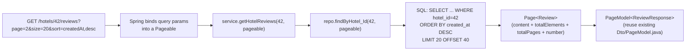
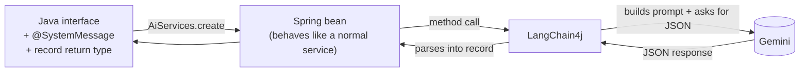
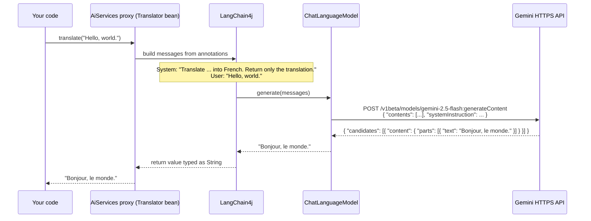
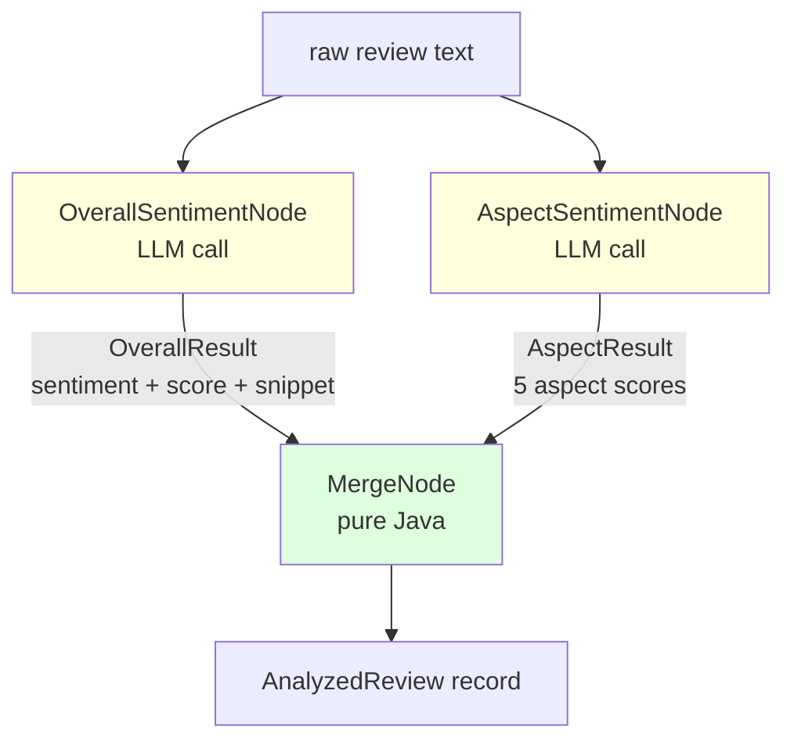
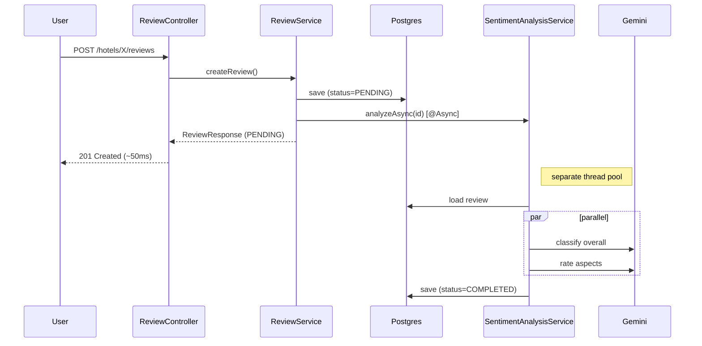
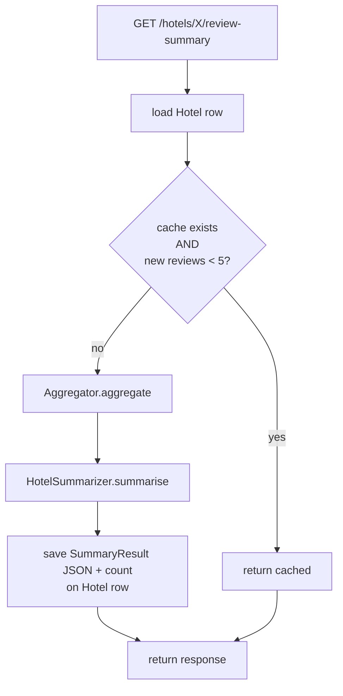
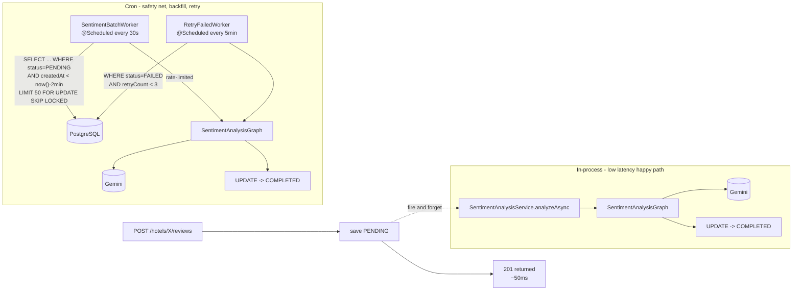

# QuickHost — Hotel Reviews + Sentiment Analysis (Tutorial Plan)

## Context

QuickHost is a Spring Boot 3.3.4 / Java 21 hotel booking platform (PostgreSQL, JPA, JWT, Stripe) at `/Users/shreshthsrivastav/Desktop/QuickHost`. Today it has `Hotel`, `Room`, `User`, `Bookings`, `Guest`, `Payement`, `Inventory` — but **no reviews and no AI**. We're building both, top-to-bottom.

End state:

- Users who completed a stay can post a review.
- Each review is auto-analysed by Gemini (sentiment + aspect scores + one-line snippet).
- A per-hotel rollup serves prospective guests with **PROS, CONS, overall rating, and a 2–3 sentence narrative** — cheap even for hotels with thousands of reviews.

Stack: 100% Java/Spring Boot. **LangChain4j** is the JVM port of LangChain with native Gemini support — no Python needed.

Choices already confirmed: booking-gated reviews · async sentiment after save · multi-node graph · on-demand cached hotel summary (regenerate when ≥5 new reviews).

---

## Current state (verified against the codebase 2026-05-13)

| Phase | Status | What's there |
|---|---|---|
| **Phase 1 — Review system** | 🟡 **Mostly done, 4 fixes needed** (see §1.13) | All entities, repos, DTOs, service, controller, security patch, ConflictException + handler in place. Build is green. But: booking gate is commented out, `ReviewResponse` is missing 5 sentiment fields, `toDto` is duplicated in service + controller, and a couple of small handler/log cleanups. |
| **Phase 2 — LangChain4j wiring** | 🟡 **Started, incomplete** (see §2.5) | `pom.xml` has `langchain4j` **1.14.1** (a major-version jump from the plan's `0.36.2`) and `resilience4j-ratelimiter` 2.4.0 already. **Missing**: the `langchain4j-google-ai-gemini` artifact, `Config/LangChain4jConfig.java`, `gemini.*` keys in `application.properties`, and the smoke test. |
| **Phase 3 — Sentiment graph** | ⏳ Not started | |
| **Phase 4 — Hotel pros/cons summary** | ⏳ Not started | |
| **Phase 5 — Lakhs-scale workers** | ⏳ Not started | |

**Codebase changes since the original plan:**

- All `*ServiceImpl.java` were moved into a new `Service/impl/` subpackage (e.g. `Service/impl/ReviewServiceImpl.java`). All new service implementations in Phases 3/4/5 should go in `Service/impl/`, not `Service/`.
- The interfaces (`ReviewService.java`, etc.) stay in `Service/` — only the impls moved.

**What works end-to-end right now**: start the app → POST `/api/v1/hotels/{H}/reviews` with a JWT → review row created with `analysisStatus=PENDING` (no analysis yet) → GET `/api/v1/hotels/{H}/reviews?page=0&size=20` returns paginated results. **But** any logged-in user can review any hotel without ever staying there (booking gate is bypassed — see §1.13).

> **Plan accuracy notes** (verified against the codebase):
> - All repos in QuickHost use the `*Repo` suffix, not `*Repository` — so the new file is `ReviewRepo.java`.
> - Enums live in `com.Project.QuickHost.Entity.enums` — `Sentiment` and `AnalysisStatus` go there.
> - `application.properties` sets `server.servlet.context-path=/api/v1`, so controller mappings use `/hotels/...` (no `/api/v1/` prefix in code — Spring adds it automatically).
> - `Dto/PageModel.java` already exists with `(content, pageNumber, pageSize, totalElements, totalPages, lastPage)` — we'll reuse it, not invent a new envelope.
> - `advice/GlobalResponseHandler` is defined as a class but **not registered** (no `@ControllerAdvice` / `@Component`) — so it's currently dormant and does NOT auto-wrap responses. Existing controllers return `ResponseEntity<DtoType>` directly (see `HotelController`, `HotelBrowseController`, `AuthController`). We match that pattern. Errors *are* wrapped via `advice/GlobalExceptionHandler` (which is `@RestControllerAdvice`).
> - `Util/AppUtils.getCurrentUser()` returns the authenticated `User` from the security context — every existing service uses this; we follow the same pattern instead of passing `userId` around.
> - `BookingStatus` has values `RESERVED, CONFIRMED, GUEST_ADDED, PAYEMENT_PENDING, CANCELLED` — **there is no `COMPLETED`**. We define "completed stay" as `bookingStatus = CONFIRMED AND checkOutDate < CURRENT_DATE` via a custom `@Query` (no enum change needed).
> - Tables use the default Postgres `public` schema (the DB is `hotel`). We don't specify `schema = "hotel"` anywhere — match existing entities.
> - Spring Boot 3.x's `CamelCaseToUnderscoresNamingStrategy` (the default) lowercases table names — so `@Table(name="Reviews")` creates the table `reviews` in Postgres, and `nextAttemptAt` becomes column `next_attempt_at`.
> - Existing entities use Lombok `@Getter @Setter` (sometimes `@Data` on DTOs, `@Builder` on `Bookings`). The new `Review` entity will use `@Getter @Setter` to match `Hotel`.
> - Existing exceptions: `ResourceNotFoundException`, `UnAuthorisedException` (msg-only constructors). The existing `advice/GlobalExceptionHandler` has a catch-all `@ExceptionHandler(Exception.class)` that returns 500 — meaning a raw `ResponseStatusException` would be flattened to 500. So for "already reviewed (409)" we add a tiny `ConflictException` class **and** a matching `@ExceptionHandler` entry, mirroring the existing `ResourceNotFoundException` / `BadRequestException` pattern.
> - Existing repos use JPQL (`@Query("""...""")`) with `@Lock(LockModeType.PESSIMISTIC_WRITE)` for pessimistic locking — see `InventoryRepo.findAndLockReservedInventory`. We match that style for the worker queue queries (no native SQL).
> - `QuickHostApplication.java` already has `@EnableScheduling` — **no annotation change needed for Phase 5**, the cron beans become active automatically once defined.

---

## High-level architecture

```mermaid
flowchart LR
    U[User] -->|POST /hotels/X/reviews| RC[ReviewController]
    RC --> RS[ReviewService]
    RS -->|verify completed stay| BR[BookingRepo]
    RS -->|save PENDING| DB[(PostgreSQL)]
    RS -.fire and forget.-> SAS[SentimentAnalysisService<br/>@Async - happy path]
    SAS --> GRAPH[SentimentAnalysisGraph]
    GRAPH -->|2 parallel calls| GEM[(Gemini via LangChain4j)]
    GRAPH -->|update row| DB

    CRON[SentimentBatchWorker<br/>@Scheduled cron - safety net]
    CRON -->|"SELECT ... FOR UPDATE SKIP LOCKED"| DB
    CRON --> GRAPH

    G[Prospective guest] -->|GET /hotels/X/review-summary| HC[ReviewController]
    HC --> HRS[HotelReviewSummaryService]
    HRS -->|cache hit?| DB
    HRS -.cache miss.-> AGG[Aggregator - Java]
    AGG --> DB
    AGG --> SUMM[HotelSummarizer - 1 Gemini call]
    SUMM --> DB
```

The whole system is built in **five phases**, each independently testable. Phases 1–4 deliver the working feature; Phase 5 makes it survive lakhs of reviews.

---

## Concepts you'll meet (LLM/LangChain glossary)

You already work with Spring, JPA, and Postgres, so we skip those. The following are the LLM-side terms the plan uses — read once, refer back as needed.

| Term | What it means in this plan |
|---|---|
| **LLM** | Large Language Model. We use **Gemini 2.5 Flash** — fast, cheap, good enough for sentiment classification + short summarisation. Stateless: each call is independent. |
| **Prompt** | The full input you send the LLM. Made of one or more *messages*. |
| **System message** | Sets the model's role / rules ("You are a hotel-review sentiment classifier. Return JSON only…"). In LangChain4j, written with `@SystemMessage` on an interface method. Same for every call to that method. |
| **User message** | The actual data to process ("Review: 'Spotless room'"). In LangChain4j, written with `@UserMessage` + `{{template}}` variables. Changes per call. |
| **Token** | Roughly 4 characters of English. Both the prompt and the response are billed/limited in tokens. A 200-word review ≈ 250 tokens. |
| **Rate limit** | Provider-imposed cap (Gemini Flash paid tier ≈ 360 calls/minute). Exceed it → HTTP 429. Phase 5 wraps every call in a Resilience4j `RateLimiter` to stay under. |
| **Structured output / JSON mode** | Instead of free-text prose, the model returns JSON matching a schema we declare. Pairs with Java `record`s for type-safe parsing. Enabled by `.responseFormat(ResponseFormat.JSON)` on the chat model. |
| **`ChatLanguageModel`** | The low-level LangChain4j bean wrapping the LLM provider. One method: `generate(prompt)`. We almost never call it directly — see next row. |
| **`AiServices`** | The high-level API. Turns *any Java interface* into an LLM-backed Spring bean. Annotations on the interface become the prompt; the return type tells LangChain4j what JSON shape to ask for. |
| **Node / Graph** | A "graph" here is a small pipeline of LLM calls (parallel or sequential) that share state. Each *node* is one LLM call. LangGraph in Python supports rich DAGs; for our fixed 3-node shape we use Java `CompletableFuture` and skip the framework. |
| **Aggregator** | A *non-LLM*, pure-Java step that reduces a big list (thousands of reviews) into a small fixed-size summary (a few averages + 8 sample snippets) the LLM can chew on cheaply. The trick that makes hotel summaries scale. |

If a term in the plan is unfamiliar, it's almost certainly in this table.

---

## Folder/file tree to create

```
src/main/java/com/Project/QuickHost/
├── Config/
│   ├── LangChain4jConfig.java                   [Phase 2]
│   ├── AsyncConfig.java                          [Phase 3]
│   └── RateLimiterConfiguration.java             [Phase 5]
├── Controller/
│   └── ReviewController.java                     [Phase 1 + 4]
├── Dto/
│   ├── CreateReviewRequest.java                  [Phase 1]
│   ├── ReviewResponse.java                       [Phase 1]
│   └── HotelReviewSummaryResponse.java           [Phase 4]
├── Entity/
│   ├── Review.java                               [Phase 1, +fields in Phase 5]
│   └── enums/
│       ├── Sentiment.java                        [Phase 1]
│       └── AnalysisStatus.java                   [Phase 1]
├── exception/
│   └── ConflictException.java                    [Phase 1]
├── Repository/
│   └── ReviewRepo.java                           [Phase 1, +queries in Phase 5]
└── Service/                              ← interfaces stay here
    ├── ReviewService.java         (interface)    [Phase 1 ✅]
    ├── HotelReviewSummaryService.java (interface)[Phase 4]
    ├── impl/                          ← all *Impl classes live here (codebase convention)
    │   ├── ReviewServiceImpl.java                [Phase 1 ✅]
    │   ├── HotelReviewSummaryServiceImpl.java    [Phase 4]
    │   └── SentimentAnalysisServiceImpl.java     [Phase 3]   (interface in Service/)
    └── sentiment/                     ← graph internals, not user-facing services
        ├── SentimentAnalysisGraph.java           [Phase 3, rate-limit in Phase 5]
        ├── SentimentBatchWorker.java             [Phase 5]
        ├── AnalyzedReview.java        (record)   [Phase 3]
        ├── HotelReviewAggregator.java            [Phase 4]
        ├── HotelAggregate.java        (record)   [Phase 4]
        ├── nodes/
        │   ├── OverallSentimentNode.java         [Phase 3]
        │   ├── AspectSentimentNode.java          [Phase 3]
        │   └── MergeNode.java                    [Phase 3]
        └── ai/
            ├── OverallSentimentExtractor.java    [Phase 3]
            ├── OverallResult.java     (record)   [Phase 3]
            ├── AspectSentimentExtractor.java     [Phase 3]
            ├── AspectResult.java      (record)   [Phase 3]
            ├── HotelSummarizer.java              [Phase 4]
            └── SummaryResult.java     (record)   [Phase 4]
```

**Tree marker key**: ✅ = file exists in codebase today (verified). Unmarked = to be created.

**Files to modify:**

| File | Change | Phase |
|---|---|---|
| `pom.xml` | add LangChain4j dependencies | 2 |
| `pom.xml` | add `resilience4j-ratelimiter` | 5 |
| `src/main/resources/application.properties` | add `gemini.*`, `review.*` keys | 2 |
| `src/main/resources/application.properties` | add `review.batch.*`, `review.retry.*` keys | 5 |
| `Entity/Hotel.java` | add 3 cache fields | 4 |
| `Entity/Review.java` | add `retryCount`, `nextAttemptAt` fields | 5 |
| `Repository/BookingRepo.java` | add `mostRecentCompletedStay(user, hotel)` @Query method | 1 |
| `advice/GlobalExceptionHandler.java` | add `@ExceptionHandler(ConflictException.class)` → 409 | 1 |
| `Repository/ReviewRepo.java` | add `lockNextBatchForAnalysis`, `lockNextFailedForRetry` queries | 5 |
| `Security/WebSecuConfig.java` | add `.requestMatchers(POST, "/hotels/*/reviews").authenticated()` | 1 |
| `Service/impl/ReviewServiceImpl.java` | wire `analyzeAsync(saved.getId())` | 3 |
| `Dto/ReviewResponse.java` | restore the 5 sentiment fields (currently commented out) | 1 cleanup (§1.13) |
| `Service/impl/ReviewServiceImpl.java` | uncomment booking gate (currently bypassed) | 1 cleanup (§1.13) |
| `advice/GlobalExceptionHandler.java` | tighten ConflictException handler signature | 1 cleanup (§1.13) |

> **All URL paths below omit the `/api/v1` prefix** — Spring adds it automatically via `server.servlet.context-path`. So `@PostMapping("/hotels/{hotelId}/reviews")` in code becomes `POST /api/v1/hotels/{hotelId}/reviews` over the wire.

---

# Phase 1 — Build the review system (no AI yet)

**Why first**: we can't analyse what doesn't exist. Get reviews flowing with plain JPA, prove the booking gate works, then add AI in Phase 3.

## 1.1 Enums

`Entity/enums/Sentiment.java`

```java
package com.Project.QuickHost.Entity.enums;
public enum Sentiment { POSITIVE, NEUTRAL, NEGATIVE }
```

`Entity/enums/AnalysisStatus.java`

```java
package com.Project.QuickHost.Entity.enums;
public enum AnalysisStatus { PENDING, COMPLETED, FAILED }
```

## 1.2 `Review` entity — follow existing `Hotel.java` Lombok style

`Entity/Review.java`

```java
package com.Project.QuickHost.Entity;

import com.Project.QuickHost.Entity.enums.AnalysisStatus;
import com.Project.QuickHost.Entity.enums.Sentiment;
import jakarta.persistence.*;
import lombok.Getter;
import lombok.Setter;
import org.hibernate.annotations.CreationTimestamp;

import java.time.LocalDateTime;
import java.util.Map;

@Entity
@Getter
@Setter
@Table(name = "Reviews",
       uniqueConstraints = @UniqueConstraint(columnNames = {"user_id", "hotel_id"}))
public class Review {
    @Id @GeneratedValue(strategy = GenerationType.IDENTITY)
    private Long id;

    @ManyToOne(fetch = FetchType.LAZY)
    @JoinColumn(name = "hotel_id", nullable = false)
    private Hotel hotel;

    @ManyToOne(fetch = FetchType.LAZY)
    @JoinColumn(name = "user_id", nullable = false)
    private User user;

    @ManyToOne(fetch = FetchType.LAZY)
    @JoinColumn(name = "booking_id")
    private Bookings booking;          // the specific stay being reviewed

    @Column(length = 4000, nullable = false)
    private String text;

    @Column(nullable = false)
    private int rating;                // user's 1..5 stars

    @CreationTimestamp
    @Column(updatable = false)
    private LocalDateTime createdAt;

    // Phase 3 populates these — null until then
    @Enumerated(EnumType.STRING)
    private Sentiment overallSentiment;

    private Double sentimentScore;     // -1.0..1.0

    @Column(length = 280)
    private String snippet;

    @ElementCollection
    @CollectionTable(name = "review_aspect_scores",
                     joinColumns = @JoinColumn(name = "review_id"))
    @MapKeyColumn(name = "aspect")
    @Column(name = "score")
    private Map<String, Double> aspectScores;

    @Enumerated(EnumType.STRING)
    private AnalysisStatus analysisStatus;

    @Column(length = 1000)
    private String analysisError;

    private LocalDateTime analyzedAt;
}
```

**Why a DB unique constraint on `(user_id, hotel_id)`**: one review per user per hotel. Postgres enforces it — no race condition.
**Why no `schema = "hotel"`**: existing entities like `Hotel`, `Bookings` don't specify a schema; tables land in Postgres's default `public` schema. Match the convention.
**Why `@ElementCollection` for aspect scores**: aspects will likely grow (wifi, breakfast, …). A side-table avoids schema churn on the main `Reviews` table.

Hibernate's `ddl-auto=update` (already set) auto-creates the tables on next startup.

## 1.3 Repository

`Repository/ReviewRepo.java`

```java
package com.Project.QuickHost.Repository;

import com.Project.QuickHost.Entity.Hotel;
import com.Project.QuickHost.Entity.Review;
import com.Project.QuickHost.Entity.User;
import com.Project.QuickHost.Entity.enums.AnalysisStatus;
import org.springframework.data.domain.Page;
import org.springframework.data.domain.Pageable;
import org.springframework.data.jpa.repository.JpaRepository;
import org.springframework.data.jpa.repository.Query;
import org.springframework.data.repository.query.Param;
import org.springframework.stereotype.Repository;

import java.util.List;

@Repository
public interface ReviewRepo extends JpaRepository<Review, Long> {
    Page<Review> findByHotel(Hotel hotel, Pageable pageable);
    Page<Review> findByHotel_Id(Long hotelId, Pageable pageable);
    boolean existsByUserAndHotel(User user, Hotel hotel);
    long countByHotel_IdAndAnalysisStatus(Long hotelId, AnalysisStatus status);
    List<Review> findTop100ByHotel_IdAndAnalysisStatusOrderByCreatedAtDesc(
        Long hotelId, AnalysisStatus status);
    @Query("select avg(r.rating) from Review r where r.hotel.id = :hotelId")
    Double averageRating(@Param("hotelId") Long hotelId);
}
```

**Why `existsByUserAndHotel(User, Hotel)`**: we already have hydrated `User` and `Hotel` entities in the service (from `AppUtils.getCurrentUser()` and `hotelRepo.findById(...)`), so passing entities is cleaner than re-deriving IDs. Spring Data JPA generates the right `WHERE user_id = ? AND hotel_id = ?` SQL automatically.
**Why `findByHotel_Id` (with underscore)**: Spring Data path-traversal syntax for `WHERE hotel.id = ?` — used in places like aggregation where we have only the ID.

## 1.4 Booking gate — proving the user stayed

`BookingStatus` does **not** have a `COMPLETED` value (it has `RESERVED, CONFIRMED, GUEST_ADDED, PAYEMENT_PENDING, CANCELLED`). We treat a stay as "completed" when the booking is `CONFIRMED` and the checkout date has passed.

A single query returns the most recent completed stay if one exists. The service uses `Optional` to fail-fast as the booking gate AND to grab the booking reference for `Review.booking`.

Add to existing `Repository/BookingRepo.java`:

```java
import org.springframework.data.domain.Pageable;
import org.springframework.data.domain.PageRequest;
import java.util.Optional;

@Query("""
       select b from Bookings b
       where b.user = :user
         and b.hotel = :hotel
         and b.bookingStatus = com.Project.QuickHost.Entity.enums.BookingStatus.CONFIRMED
         and b.checkOutDate < CURRENT_DATE
       order by b.checkOutDate desc
       """)
List<Bookings> findCompletedStaysOrdered(@Param("user") User user,
                                          @Param("hotel") Hotel hotel,
                                          Pageable pageable);

default Optional<Bookings> mostRecentCompletedStay(User user, Hotel hotel) {
    return findCompletedStaysOrdered(user, hotel, PageRequest.of(0, 1))
        .stream().findFirst();
}
```

**Why one query, not two**: previous draft had separate `hasCompletedStay()` + `findCompletedStays().get(0)`. Two queries open a race window and `.get(0)` on an empty list crashes. One Optional-returning query is both safer and faster.
**Why JPQL, not a derived name**: derived method names don't compose enums + date comparisons cleanly. Matches `InventoryRepo`'s `@Query("""...""")` style.

## 1.5 Pagination — the proper way

**Why pagination matters**: a popular hotel will have thousands of reviews. Returning them all in one response is slow on the server, huge on the wire, and unusable on the client. Pagination ships a small slice + a cursor for "next page."

### Two common styles

| Style | URL example | Pro | Con |
|---|---|---|---|
| **Offset/limit** (Spring Data default) | `?page=0&size=20&sort=createdAt,desc` | Easy. Jump to any page. | Slow on huge tables for high page numbers (DB still scans skipped rows). |
| **Cursor/keyset** | `?afterId=12345&size=20` | Stable & fast even on page 10,000. | Forward-only; no "page 47" link. |

For QuickHost reviews we use **offset pagination** — Spring Data gives it free, and 100 pages of 20 reviews each (2,000 reviews shown) is well within Postgres's comfort zone. If a hotel ever crosses ~50k reviews we'll switch to cursor — future problem.

### How Spring Data wires it up



### Code — reuse the existing `PageModel<T>`

QuickHost already has `Dto/PageModel.java` (used in `HotelBrowseController.serchingHotel`). It has fields `(content, pageNumber, pageSize, totalElements, totalPages, lastPage)`. We mirror that controller's mapping pattern:

```java
@GetMapping("/hotels/{hotelId}/reviews")
public ResponseEntity<PageModel<ReviewResponse>> list(
        @PathVariable Long hotelId,
        @PageableDefault(size = 20, sort = "createdAt",
                         direction = Sort.Direction.DESC) Pageable pageable) {

    Page<Review> page = reviewService.getHotelReviews(hotelId, pageable);
    List<ReviewResponse> content = page.getContent().stream().map(this::toDto).toList();
    PageModel<ReviewResponse> body = new PageModel<>(content, page.getNumber(), page.getSize(),
            page.getTotalElements(), page.getTotalPages(), page.isLast());

    return ResponseEntity.ok(body);
}
```

(Matches the `HotelBrowseController.serchingHotel` pattern exactly — same `Page` → `PageModel` projection inside a `ResponseEntity.ok(...)`.)

Add to `application.properties` to cap page size globally:

```properties
spring.data.web.pageable.max-page-size=100
spring.data.web.pageable.default-page-size=20
```

**Why `@PageableDefault`**: defaults if the client forgets `page`/`size`. **Why the global cap**: client can't request `size=999999` and OOM us.

## 1.6 New `ConflictException` (+ handler)

`exception/ConflictException.java` — mirrors the shape of `UnAuthorisedException` / `ResourceNotFoundException`:

```java
package com.Project.QuickHost.exception;

public class ConflictException extends RuntimeException {
    public ConflictException(String message) { super(message); }
}
```

Add one handler to `advice/GlobalExceptionHandler.java` (right next to the existing `ResourceNotFoundException` handler):

```java
@ExceptionHandler(ConflictException.class)
public ResponseEntity<ApiResponse<?>> handleConflict(ConflictException ex) {
    ApiError error = ApiError.builder()
            .status(HttpStatus.CONFLICT)
            .message(ex.getMessage())
            .build();
    return new ResponseEntity<>(new ApiResponse<>(error), HttpStatus.CONFLICT);
}
```

**Why a real class instead of `ResponseStatusException`**: the existing `@ExceptionHandler(Exception.class)` catch-all (line 50 of `GlobalExceptionHandler`) flattens any otherwise-unhandled exception to 500. A real class + dedicated handler is the only path that yields a real 409.

## 1.7 Service

`Service/ReviewService.java` (interface):

```java
package com.Project.QuickHost.Service;

import com.Project.QuickHost.Dto.CreateReviewRequest;
import com.Project.QuickHost.Dto.ReviewResponse;
import com.Project.QuickHost.Entity.Review;
import org.springframework.data.domain.Page;
import org.springframework.data.domain.Pageable;

public interface ReviewService {
    ReviewResponse createReview(Long hotelId, CreateReviewRequest req);
    Page<Review> getHotelReviews(Long hotelId, Pageable pageable);
    ReviewResponse getReview(Long id);
}
```

`Service/ReviewServiceImpl.java`:

```java
@Service @Slf4j @RequiredArgsConstructor
public class ReviewServiceImpl implements ReviewService {
    private final ReviewRepo reviewRepo;
    private final HotelRepo hotelRepo;
    private final BookingRepo bookingRepo;
    // private final SentimentAnalysisService sentimentAnalysisService; // added in Phase 3

    @Override
    @Transactional
    public ReviewResponse createReview(Long hotelId, CreateReviewRequest req) {
        User user = AppUtils.getCurrentUser();
        Hotel hotel = hotelRepo.findById(hotelId)
            .orElseThrow(() -> new ResourceNotFoundException("Hotel " + hotelId));

        Bookings stay = bookingRepo.mostRecentCompletedStay(user, hotel)
            .orElseThrow(() -> new UnAuthorisedException("Complete a stay before reviewing."));

        if (reviewRepo.existsByUserAndHotel(user, hotel))
            throw new ConflictException("You have already reviewed this hotel.");

        Review r = new Review();
        r.setUser(user);
        r.setHotel(hotel);
        r.setBooking(stay);
        r.setText(req.text());
        r.setRating(req.rating());
        r.setAnalysisStatus(AnalysisStatus.PENDING);
        Review saved = reviewRepo.save(r);

        // Phase 3 inserts: sentimentAnalysisService.analyzeAsync(saved.getId());
        return toDto(saved);
    }

    @Override
    public Page<Review> getHotelReviews(Long hotelId, Pageable pageable) {
        return reviewRepo.findByHotel_Id(hotelId, pageable);
    }

    @Override
    public ReviewResponse getReview(Long id) {
        return toDto(reviewRepo.findById(id)
            .orElseThrow(() -> new ResourceNotFoundException("Review " + id)));
    }
}
```

**Why `AppUtils.getCurrentUser()`**: every existing service (`HotelServiceImpl`, `BookingServiceImpl`, `RoomServiceImpl`, `CheckoutServiceImpl`) uses this exact pattern. Match it.
**Why one `.orElseThrow` for the booking gate**: the same `Optional<Bookings>` doubles as gate (`UnAuthorisedException` if empty) and source of the `booking` reference for the new `Review`. No duplicate DB hit.

## 1.8 DTOs

`Dto/CreateReviewRequest.java`

```java
public record CreateReviewRequest(
    @NotBlank @Size(max = 4000) String text,
    @Min(1) @Max(5) int rating
) {}
```

`Dto/ReviewResponse.java`

```java
public record ReviewResponse(
    Long id, Long hotelId, Long userId,
    String text, int rating, LocalDateTime createdAt,
    Sentiment overallSentiment, Double sentimentScore, String snippet,
    Map<String, Double> aspectScores,
    AnalysisStatus analysisStatus, LocalDateTime analyzedAt
) {}
```

Reuse the existing `Dto/PageModel.java` for list responses.

## 1.9 Controller

`Controller/ReviewController.java`

```java
@RestController
@RequiredArgsConstructor
@Slf4j
public class ReviewController {
    private final ReviewService reviewService;
    // private final HotelReviewSummaryService summaryService; // Phase 4

    @PostMapping("/hotels/{hotelId}/reviews")
    public ResponseEntity<ReviewResponse> create(@PathVariable Long hotelId,
                                                  @Valid @RequestBody CreateReviewRequest req) {
        return new ResponseEntity<>(reviewService.createReview(hotelId, req), HttpStatus.CREATED);
    }

    @GetMapping("/hotels/{hotelId}/reviews")
    public ResponseEntity<PageModel<ReviewResponse>> list(
            @PathVariable Long hotelId,
            @PageableDefault(size = 20, sort = "createdAt",
                             direction = Sort.Direction.DESC) Pageable pageable) {
        Page<Review> page = reviewService.getHotelReviews(hotelId, pageable);
        List<ReviewResponse> content = page.getContent().stream().map(this::toDto).toList();
        PageModel<ReviewResponse> body = new PageModel<>(content, page.getNumber(), page.getSize(),
                page.getTotalElements(), page.getTotalPages(), page.isLast());
        return ResponseEntity.ok(body);
    }

    @GetMapping("/reviews/{id}")
    public ResponseEntity<ReviewResponse> get(@PathVariable Long id) {
        return ResponseEntity.ok(reviewService.getReview(id));
    }
}
```

> Routes are absolute paths (no class-level `@RequestMapping`) because they straddle `/hotels/...` and `/reviews/...`. Spring's `/api/v1` context-path is added automatically.
>
> Return-type style (`ResponseEntity<XxxDto>`) matches every other controller in the project — `HotelController`, `HotelBrowseController`, `AuthController`, `HotelBookingController`.

## 1.10 Security — open the new routes

Patch `Security/WebSecuConfig.java` inside `authorizeHttpRequests(...)`, before `anyRequest().permitAll()`:

```java
.requestMatchers(HttpMethod.POST, "/hotels/*/reviews").authenticated()
```

GETs on `/hotels/*/reviews` and `/reviews/*` fall through to the existing `anyRequest().permitAll()` — public, matching how `/hotels/search` is public today. (You'll need `import org.springframework.http.HttpMethod;` in `WebSecuConfig` — it isn't there today since the existing rules are string-only.)

## 1.11 Phase 1 build order

1. Create the two enums in `Entity/enums/`.
2. Create `Entity/Review.java`.
3. Run the app once — Hibernate auto-creates the tables (Spring Boot's `CamelCaseToUnderscoresNamingStrategy` lowercases the names → `reviews` and `review_aspect_scores`). Verify: `psql -d hotel -c '\d reviews'` and `\d review_aspect_scores`.
4. Create `Repository/ReviewRepo.java`.
5. Add `mostRecentCompletedStay(...)` to `Repository/BookingRepo.java`.
6. Create `exception/ConflictException.java` and add the matching `@ExceptionHandler` to `advice/GlobalExceptionHandler.java`.
7. Create DTOs (`CreateReviewRequest`, `ReviewResponse`).
8. Create `Service/ReviewService.java` + `Service/ReviewServiceImpl.java`.
9. Create `Controller/ReviewController.java`.
10. Patch `Security/WebSecuConfig.java`.
11. `./mvnw clean package` — green.

## 1.13 Phase 1 cleanup — fixes to apply before moving on

Doing the next phases on top of these issues will compound them. Tackle in this order.

### 🔴 Fix 1 — Re-enable the booking gate (CRITICAL, security)

In [Service/impl/ReviewServiceImpl.java:42](src/main/java/com/Project/QuickHost/Service/impl/ReviewServiceImpl.java) the booking-gate lines are commented out, so any authenticated user can review any hotel without ever staying there.

Uncomment them:

```java
Bookings stay = bookingRepo.mostRecentCompletedStay(user, hotel)
        .orElseThrow(() -> new UnAuthorisedException("Complete a stay before reviewing."));
// ...
r.setBooking(stay);
```

For local testing without a completed `Bookings` row: either (a) seed one via SQL (`INSERT INTO bookings (user_id, hotel_id, booking_status, check_out_date, ...) VALUES (..., 'CONFIRMED', '2025-01-01', ...)`), or (b) temporarily replace the throw with a `log.warn(...)` *only* during development — never check that into main.

### 🔴 Fix 2 — Restore the 5 sentiment fields on `ReviewResponse`

[Dto/ReviewResponse.java](src/main/java/com/Project/QuickHost/Dto/ReviewResponse.java) currently has only `id, hotelId, userId, text, rating, createdAt, analyzedAt`. The sentiment/aspect/status fields are commented out — meaning when Phase 3 populates them, **clients won't see them**. The whole point of the AI work is invisible.

Restore the record to:

```java
package com.Project.QuickHost.Dto;

import com.Project.QuickHost.Entity.enums.AnalysisStatus;
import com.Project.QuickHost.Entity.enums.Sentiment;
import java.time.LocalDateTime;
import java.util.Map;

public record ReviewResponse(
        Long id, Long hotelId, Long userId,
        String text, int rating, LocalDateTime createdAt,
        Sentiment overallSentiment, Double sentimentScore, String snippet,
        Map<String, Double> aspectScores,
        AnalysisStatus analysisStatus, LocalDateTime analyzedAt
) {}
```

### 🟡 Fix 3 — De-duplicate `toDto` onto the record itself

`toDto(Review r)` exists in **both** [ReviewServiceImpl.java:73](src/main/java/com/Project/QuickHost/Service/impl/ReviewServiceImpl.java) and [ReviewController.java:54](src/main/java/com/Project/QuickHost/Controller/ReviewController.java). Two definitions of the same mapper will drift apart the moment one side gets updated.

Move it to a static factory on the record (cleanest for Java records — ModelMapper is flaky with records):

```java
public record ReviewResponse(...) {
    public static ReviewResponse from(Review r) {
        return new ReviewResponse(
                r.getId(), r.getHotel().getId(), r.getUser().getId(),
                r.getText(), r.getRating(), r.getCreatedAt(),
                r.getOverallSentiment(), r.getSentimentScore(), r.getSnippet(),
                r.getAspectScores(), r.getAnalysisStatus(), r.getAnalyzedAt());
    }
}
```

Then both call sites become `ReviewResponse.from(saved)` / `.map(ReviewResponse::from)`, and the private `toDto` method disappears from both classes.

### 🟢 Fix 4 — Two cosmetic cleanups

a) [GlobalExceptionHandler.java:95](src/main/java/com/Project/QuickHost/advice/GlobalExceptionHandler.java) — the handler signature uses `Exception ex` instead of `ConflictException ex`, and the message has a typo ("Conflic"). It works because Spring narrows by the annotation, but tighten it:

```java
@ExceptionHandler(ConflictException.class)
public ResponseEntity<ApiResponse<?>> handleConflictException(ConflictException ex) {
    ApiError error = ApiError.builder()
            .status(HttpStatus.CONFLICT)
            .message(ex.getMessage())
            .build();
    return new ResponseEntity<>(new ApiResponse<>(error), HttpStatus.CONFLICT);
}
```

b) [ReviewController.java:33-34](src/main/java/com/Project/QuickHost/Controller/ReviewController.java) — drop the `log.info("rating: ...")` / `log.info("twst...")` debug lines before Phase 2 (the second one has a typo too).

### Re-verify after the four fixes

1. App still starts.
2. `POST /api/v1/hotels/{H}/reviews` as a user with a past `CONFIRMED` booking with `check_out_date < today` → 201.
3. Same POST as a user with no qualifying booking → 401 (UnAuthorisedException → JSON `ApiResponse<ApiError>` with `status: UNAUTHORIZED`).
4. Repeat POST as the same user/hotel → 409 (ConflictException → `status: CONFLICT`).
5. `GET /api/v1/reviews/{id}` → response shows the full DTO including `overallSentiment`, `sentimentScore`, etc. (all nulls until Phase 3, but the fields exist in the JSON).
6. `GET /api/v1/hotels/{H}/reviews?page=0&size=2` → paged `PageModel<ReviewResponse>` with the same full DTO shape.

Only then move to Phase 2.

## 1.12 Phase 1 verification (original)

1. App starts; `psql -d hotel -c '\dt'` shows the new `reviews` table.
2. Seed a `CONFIRMED` booking for user U on hotel H with `checkOutDate = '2025-01-01'` (in the past).
3. As U: `POST /api/v1/hotels/{H}/reviews` → 201.
4. As a user with no past confirmed booking → 401/403 (UnAuthorisedException).
5. POST a second review as U for H → 409 (CONFLICT).
6. `GET /api/v1/hotels/{H}/reviews?page=0&size=2` → 2 items + correct `totalElements`.

---

# Phase 2 — Wire up LangChain4j + Gemini

This phase is pure plumbing. No features yet. Goal: **one Gemini call works from a Spring bean.**

> **Status note**: pom.xml already has `langchain4j 1.14.1` and `resilience4j-ratelimiter 2.4.0`. **You still need** the Gemini provider artifact, the config bean, the properties, and the smoke test — see §2.5 for the exact next steps in current state.

## 2.0 Gen AI in 5 minutes (read first if new to LLMs)

Skip this section if you already know what an LLM is, how prompts work, and what a token is. Otherwise spend 5 minutes here — everything else in Phases 2–5 assumes these concepts.

### What is a Gen AI / LLM?

An **LLM (Large Language Model)** like Gemini, GPT-4, or Claude is a program you talk to in plain English. You give it text, it gives you text back.

```
You:    "Is this review positive or negative? 'The room was spotless.'"
LLM:    "Positive."
```

That's the whole API surface. The interesting parts are *what you put in* (the prompt) and *how you shape the output* (free text vs structured JSON).

### Why use an LLM for hotel reviews — and not regex / sentiment-dictionary?

Traditional rule-based sentiment ("count positive words, subtract negative words") breaks on real reviews:

- *"The pool was nice but everything else was a disaster."* → has 2 positive words ("nice", "pool"), 1 negative ("disaster"). Rule-based says: positive. Reality: negative.
- *"The location is supposedly great but I wouldn't know — couldn't get to my room because the elevator broke for 6 hours."* → most positive words, but a damning review.

LLMs read *meaning*, not keywords. They also extract structured info ("which aspects did the guest complain about?") that's impossible with regex. The trade-off: they cost money per call, they're slower (~1–3s per request), they occasionally make things up.

### Key concepts you'll meet (one-line each)

| Concept | One-liner |
|---|---|
| **Prompt** | The text you send the LLM. Often split into a **system message** (rules: "You are a sentiment classifier") and a **user message** (the data: "Review: 'Spotless room'"). |
| **Token** | Roughly 4 characters of English. Both input and output are billed and rate-limited in tokens. A 200-word review ≈ 250 tokens. |
| **Temperature** | A number 0.0–1.0. Lower = more deterministic (same input → same output). Higher = more creative/random. We use **0.2** because sentiment classification should be near-deterministic. |
| **JSON mode / structured output** | A model setting that says "respond with JSON matching this schema". Eliminates fragile string parsing. We use it everywhere. |
| **Hallucination** | LLMs sometimes invent confident-sounding nonsense. Mitigations: low temperature, strict JSON schema, prompt rules like "do not invent specifics not present in the input" (used in §4.4). |
| **Rate limit** | Providers cap calls/minute (Gemini Flash ≈ 360 RPM paid tier). Exceed → HTTP 429. Phase 5 wraps every call in a Resilience4j limiter. |
| **Context window** | Max tokens per call (Gemini 2.5 Flash: ~1M). Big enough for our use; we still aggregate-before-summarising in Phase 4 to keep cost down. |

### Free vs paid Gemini

- **Free tier** (AI Studio): ~15 requests/minute. Enough for local development and Phase 1–3 testing.
- **Paid tier** (Google AI Studio billing enabled): ~360 RPM for Flash. Needed for Phase 4 testing at any volume and Phase 5 backfills.
- **Cost** for Flash is fractions of a cent per call. A million reviews ≈ a few dollars.
- Get a key at [aistudio.google.com/apikey](https://aistudio.google.com/apikey) — works without billing for the free tier.

### LangChain (Python) vs LangChain4j vs LangGraph — what are we actually using?

You'll see these names everywhere. They're related but distinct:

| Name | What it is | Are we using it? |
|---|---|---|
| **LangChain** (Python) | The original library: wraps LLM providers, chains prompts, parses output. Most LLM tutorials online use this. | **No** — we're on the JVM. |
| **LangChain4j** | The Java port. Same ideas, idiomatic Java. Works with Spring Boot via beans. | **Yes** — this is in your `pom.xml`. |
| **LangGraph** (Python) | A *separate* library on top of LangChain for orchestrating multi-step LLM workflows as a state machine / DAG. Powerful but Python-only. | **No** — Java has no equivalent. We build our 3-node "graph" with plain `CompletableFuture` (see §3.3) — small enough that a framework would be overkill. |
| **Gemini** | Google's LLM family (gemini-2.5-flash, gemini-2.5-pro, etc.). Just a model — accessed via API. | **Yes** — we use `gemini-2.5-flash`. |
| **AI Studio** | Google's web UI to test prompts and grab API keys. | Use it to get your key + play with prompts before coding. |

The mental model: **LangChain4j is the steering wheel. Gemini is the engine. AI Studio is the driving school.**

### When to look at an LLM tutorial vs trust this plan

This plan teaches you *just enough* to ship the QuickHost feature. If you want deeper:

- **LangChain4j docs**: [docs.langchain4j.dev](https://docs.langchain4j.dev) — current API for 1.x.
- **Gemini API docs**: [ai.google.dev/api](https://ai.google.dev/api) — model capabilities, limits, pricing.
- **Prompt engineering basics**: search "OpenAI prompt engineering guide" — the principles transfer to Gemini.

Now you're equipped to read §2.1.

## 2.1 What is LangChain4j? (concept primer)

LangChain4j is the Java port of LangChain. Three pieces matter for us:

| Concept | What it is | Tiny example |
|---|---|---|
| **`ChatLanguageModel`** | A bean wrapping the LLM provider. `model.generate("text")` returns a string. | `GoogleAiGeminiChatModel.builder().apiKey(...).build()` |
| **`AiServices`** | Turns a Java *interface* into an LLM-backed bean. Annotations become the prompt. | `AiServices.create(Translator.class, model)` |
| **Structured output** | Declare a `record`, get back parsed JSON. No manual prompt-then-parse. | `record Translation(String text, String lang) {}` |

Mental model:



You almost never call `ChatLanguageModel.generate(...)` directly in app code. You describe what you want with an interface, and `AiServices` does the prompting, JSON-coaxing, and parsing.

One screen of working example:

```java
// 1. Interface — the annotations ARE the prompt
interface Translator {
    @SystemMessage("Translate the user's text into French. Return only the translation.")
    String translate(@UserMessage String text);
}

// 2. Engine
ChatLanguageModel model = GoogleAiGeminiChatModel.builder()
    .apiKey(System.getenv("GEMINI_API_KEY"))
    .modelName("gemini-2.5-flash")
    .build();

// 3. Bind
Translator t = AiServices.create(Translator.class, model);

// 4. Call
String fr = t.translate("Hello, world.");   // "Bonjour, le monde."
```

### Under the hood: what `t.translate("Hello, world.")` actually does



Five things to internalise from that diagram:

1. **The interface call is a proxy method**, not a normal one — Spring/LangChain4j intercept it.
2. **Annotations build the prompt** — `@SystemMessage` becomes the system instruction, `@UserMessage` + `@V("text")` becomes the user turn.
3. **The HTTP call to Gemini is synchronous** — `t.translate(...)` blocks until the response arrives (typically 0.5–2s).
4. **The return type drives parsing** — `String` → text out as-is. `record OverallResult(...)` (Phase 3) → LangChain4j tells Gemini "respond as JSON matching this schema" and parses the JSON into the record.
5. **No state between calls** — each invocation builds a fresh prompt. If you want memory, you'd pass a `@MemoryId` parameter; we don't need that here.

Everything in Phase 3 follows this exact pattern — just with richer interfaces and JSON record returns.

## 2.2 Add Maven dependencies to `pom.xml`

```xml
<dependency>
  <groupId>dev.langchain4j</groupId>
  <artifactId>langchain4j</artifactId>
  <version>0.36.2</version>
</dependency>
<dependency>
  <groupId>dev.langchain4j</groupId>
  <artifactId>langchain4j-google-ai-gemini</artifactId>
  <version>0.36.2</version>
</dependency>
```

## 2.3 Configuration

Append to `src/main/resources/application.properties`:

```properties
gemini.api.key=${GEMINI_API_KEY}
gemini.model=gemini-2.5-flash
gemini.temperature=0.2

review.summary.regen-threshold=5
review.analysis.timeout-seconds=15

spring.data.web.pageable.max-page-size=100
spring.data.web.pageable.default-page-size=20
```

Then `export GEMINI_API_KEY=…` in your shell (or your IDE run config).

`Config/LangChain4jConfig.java`:

```java
package com.Project.QuickHost.Config;

import dev.langchain4j.model.chat.ChatLanguageModel;
import dev.langchain4j.model.googleai.GoogleAiGeminiChatModel;
import dev.langchain4j.model.chat.request.ResponseFormat;
import org.springframework.beans.factory.annotation.Value;
import org.springframework.context.annotation.Bean;
import org.springframework.context.annotation.Configuration;

@Configuration
public class LangChain4jConfig {
    @Bean
    public ChatLanguageModel geminiModel(
            @Value("${gemini.api.key}") String key,
            @Value("${gemini.model}") String name,
            @Value("${gemini.temperature}") double temp) {
        return GoogleAiGeminiChatModel.builder()
            .apiKey(key).modelName(name).temperature(temp)
            .responseFormat(ResponseFormat.JSON)
            .build();
    }
}
```

**Why `temperature=0.2`**: sentiment classification needs to be near-deterministic. Higher values let the same review score differently across calls.
**Why `responseFormat=JSON`**: forces Gemini to return valid JSON instead of conversational prose — pairs with structured records in Phase 3.

## 2.4 Smoke test

Add to `QuickHostApplication.java` (delete after verifying):

```java
@Bean CommandLineRunner llmSmoke(ChatLanguageModel m) {
    return args -> System.out.println("Gemini says: " + m.generate("Say hi in 5 words."));
}
```

Start the app — if you see a 5-word reply in the console, Phase 2 is done.

## 2.5 Phase 2 — step-by-step (tutorial-style)

You already added `langchain4j 1.14.1` to `pom.xml`. Five steps remain. Each step has **What / How / Why** so you understand the move, not just type it.

---

### Step 1 — Add the Gemini provider artifact to `pom.xml`

**What**: a Maven dependency for the Google AI Gemini transport.

**How**: paste this into `<dependencies>`, next to your existing `langchain4j` block.

```xml
<dependency>
    <groupId>dev.langchain4j</groupId>
    <artifactId>langchain4j-google-ai-gemini</artifactId>
    <version>1.14.1</version>
</dependency>
```

Then run `./mvnw clean package` to confirm Maven downloads it.

**Why**: LangChain4j is split into a **core** library (the `AiServices`, annotations, interfaces) and **per-provider** transport libraries (one for OpenAI, one for Anthropic, one for Google AI / Gemini, etc.). You add only the transport(s) you use. The core artifact you already have doesn't know how to talk to Gemini until you add this.

---

### Step 2 — Know the LangChain4j 1.x API shape (heads-up before writing code)

**What**: a 60-second orientation on what classes exist in your version of LangChain4j, so the auto-import suggestions in your IDE make sense.

**How**: scan this table before writing the config bean. Don't memorise — just know "these names move around between versions; I'll let the IDE find them."

| Concept | Likely class name in 1.14 | Method you'll call |
|---|---|---|
| The chat-model interface a bean implements | `ChatLanguageModel` *or* `ChatModel` (depends on the exact 1.x minor — IDE will tell you) | `generate(String)` or `chat(String)` |
| The Gemini implementation of that interface | `GoogleAiGeminiChatModel` in `dev.langchain4j.model.googleai` | `.builder().apiKey(...).modelName(...).build()` |
| Telling the model to emit JSON | `ResponseFormat.JSON` (constant) or `ResponseFormat.builder().type(JSON).build()` | Pass to `.responseFormat(...)` on the builder |
| Building an LLM-backed Spring bean from an interface | `AiServices.create(MyInterface.class, model)` | Returns an instance of `MyInterface` |
| Annotations on your interface methods | `@SystemMessage`, `@UserMessage`, `@V("name")` in `dev.langchain4j.service` | Drive prompt assembly |

**Why**: LangChain4j hit 1.0 in late 2024 and did some renames. The original plan was sketched against 0.36.x; your pom now uses 1.14.1. **Practical rule**: write the code as shown in §2.3 / Phase 3. If your IDE flags a "class not found" on `ChatLanguageModel`, accept the auto-import suggestion (likely `ChatModel`). Don't downgrade — 1.14.1 is the right choice.

---

### Step 3 — Append Gemini config to `application.properties`

**What**: five new property keys.

**How**: append to `src/main/resources/application.properties`:

```properties
# Gemini (Phase 2)
gemini.api.key=${GEMINI_API_KEY}
gemini.model=gemini-2.5-flash
gemini.temperature=0.2

# Review pipeline (Phase 4/5 — add now, use later)
review.summary.regen-threshold=5
review.analysis.timeout-seconds=15
```

Then set the env var in your shell *or* IDE run config:

```bash
export GEMINI_API_KEY="your-key-from-aistudio"
```

Get a free key at [aistudio.google.com/apikey](https://aistudio.google.com/apikey).

**Why each key**:

- `gemini.api.key=${GEMINI_API_KEY}` — Spring resolves `${...}` against environment variables at startup. **Never** put the literal key in source — it'd leak into git. Failing-fast at startup if the env var is missing is better than failing per-request.
- `gemini.model=gemini-2.5-flash` — Flash is the cheap+fast variant. Pro exists but isn't justified for sentiment classification.
- `gemini.temperature=0.2` — sentiment should be near-deterministic (same review → same score). 0.0 is technically valid but a tiny non-zero value avoids edge cases in Gemini's sampling.
- `review.summary.regen-threshold=5` — Phase 4 reads this. Means "regenerate hotel summary when 5+ new reviews exist since last cache". Tunable per env.
- `review.analysis.timeout-seconds=15` — Phase 3 will use this to cap LLM-call duration so a hung Gemini call can't block a worker thread forever.

---

### Step 4 — Create `Config/LangChain4jConfig.java`

**What**: a Spring `@Configuration` class that exposes `ChatLanguageModel` (or `ChatModel`) as a bean.

**How**: copy the code from §2.3 into `src/main/java/com/Project/QuickHost/Config/LangChain4jConfig.java`. If your IDE flags `ChatLanguageModel`, accept the auto-import suggestion of `ChatModel` and rename the method/return type to match.

**Why this matters in Spring terms**: by declaring `@Bean ChatLanguageModel geminiModel(...)`, you're saying "Spring, build one of these at startup, hand it to anyone who needs it." From Phase 3 onwards, every node class will get this bean injected automatically — they never call `GoogleAiGeminiChatModel.builder()` themselves. One place to change the model (test vs prod, Flash vs Pro), no scattered builder calls.

**Why `responseFormat=JSON` here, on the model itself**: this is a model-level toggle that affects **every** call routed through this bean. All our prompts in Phase 3/4 expect JSON back. Setting it once on the bean means individual AI services don't have to repeat it.

---

### Step 5 — Smoke test

**What**: a throwaway `CommandLineRunner` that proves the bean works.

**How**: paste this into `QuickHostApplication.java`, run the app, then delete it after the message appears:

```java
@Bean
CommandLineRunner llmSmoke(dev.langchain4j.model.chat.ChatLanguageModel m) {
    return args -> System.out.println("Gemini says: " + m.generate("Say hi in 5 words."));
}
```

(If your IDE replaced `ChatLanguageModel` with `ChatModel`, swap accordingly and use `m.chat(...)` instead of `m.generate(...)`.)

**Expected console output** (something like):

```
Gemini says: Hello there, how are you?
```

**Why a smoke test before features**: it isolates "is my Gemini key + dependency + config correct?" from "is my graph/async/JSON-parsing logic correct?". When something breaks in Phase 3, you'll know it's not Phase 2's plumbing.

**Failure modes you might hit and what they mean**:

| Symptom | Likely cause | Fix |
|---|---|---|
| App fails to start, `IllegalArgumentException: Could not resolve placeholder 'GEMINI_API_KEY'` | Env var not set | `export GEMINI_API_KEY=...` and restart your IDE/terminal |
| App starts but `Gemini says:` prints an error JSON | Bad key or no AI Studio access | Re-issue key at [aistudio.google.com/apikey](https://aistudio.google.com/apikey) |
| `ClassNotFoundException: dev.langchain4j.model.googleai.GoogleAiGeminiChatModel` | Step 1 not done | Add the `langchain4j-google-ai-gemini` artifact |
| `429 Too Many Requests` | Free-tier limit (15 RPM) hit | Wait a minute; you'll add a real rate limiter in Phase 5 |

**Phase 2 is done when**: app boots cleanly, smoke test prints a Gemini reply, no LangChain4j / Gemini errors in logs.

---

### Step 6 — Move on to Phase 3

When Phase 2 is green:

- Delete the smoke `CommandLineRunner`.
- Read §3.1 (graph concept) before writing any node code.
- New service `*Impl` classes go in `Service/impl/` (matching your existing convention), not directly under `Service/`. The plan's file tree was updated to reflect this.
- The interfaces (e.g. `SentimentAnalysisService.java`) stay in `Service/`. Mirrors how `ReviewService.java` / `ReviewServiceImpl.java` are split today.

---

# Phase 3 — Per-review sentiment analysis (the "graph")

Now the AI. Per review we extract:

- `overallSentiment` enum + `sentimentScore` ∈ [-1, 1] + a one-line `snippet`
- `aspectScores` for `cleanliness, service, location, value, room`

## 3.1 What "graph" means here

In LangChain Python, **LangGraph** wires LLM calls as a DAG of nodes with shared state. Java doesn't have a direct port, but for a fixed shape like ours, three small classes + `CompletableFuture` give the same thing without dragging in a framework.



**Why parallel**: the two LLM nodes don't depend on each other (both consume raw text). Running in parallel ≈ halves wall-clock latency for the same cost.
**Why not a third LLM node for the snippet**: the snippet is small enough to ask for inside the same JSON as the overall sentiment — one fewer round-trip.

## 3.2 Each node, tutorial-style

### Tiny prompt-engineering primer (read before writing the first node)

You're about to write a `@SystemMessage`. That string is **the only thing controlling how Gemini behaves** for that node. Three rules of thumb that apply to every prompt in this plan:

1. **Be specific about output format.** "Return JSON" is weak; "Return JSON with fields `sentiment`, `score`, `snippet`" is strong. The more you constrain, the less the model can drift.
2. **Use enum values, not "positive/negative-ish" wording.** `POSITIVE | NEUTRAL | NEGATIVE` is parseable by your enum; "very good", "kinda bad" is not.
3. **Forbid the failure modes you fear.** In §4.4 we'll write `"Do not invent specifics not present in the input"` because hallucinated pros/cons would mislead guests. Whatever your nightmare-output is, write a sentence telling the model not to produce it.

This is called **prompt engineering**. It's iterative — your first prompt won't be perfect. You'll tighten it as you see the model misbehave on real reviews.

### Node 1 — `OverallSentimentNode`

`Service/sentiment/ai/OverallResult.java`:

```java
public record OverallResult(Sentiment sentiment, double score, String snippet) {}
```

`Service/sentiment/ai/OverallSentimentExtractor.java`:

```java
public interface OverallSentimentExtractor {
    @SystemMessage("""
        You are a hotel-review sentiment classifier. Read the review and return JSON only.
        Fields:
          sentiment: POSITIVE | NEUTRAL | NEGATIVE
          score:     decimal in [-1.0, 1.0] (-1 very negative, 1 very positive)
          snippet:   single sentence, max 200 chars, summarising the review
        """)
    @UserMessage("Review: {{text}}")
    OverallResult classify(@V("text") String text);
}
```

**Reading this from top to bottom**:

- `@SystemMessage(...)` becomes the LLM's *system* turn — its rules. Same for every call.
- `@UserMessage("Review: {{text}}")` becomes the *user* turn. `{{text}}` is a template placeholder.
- `@V("text") String text` is the value that fills `{{text}}`. The `@V` name and the template name must match.
- `OverallResult classify(...)` — the return type tells LangChain4j what JSON schema to ask Gemini for. It then parses the JSON into a record. **You write zero JSON parsing code.**

At runtime, calling `classify("Spotless room")` produces this conversation:

```
SYSTEM: You are a hotel-review sentiment classifier...
USER:   Review: Spotless room
```

…and parses Gemini's `{"sentiment": "POSITIVE", "score": 0.92, "snippet": "Guest praised cleanliness."}` straight into an `OverallResult` instance.

Add to `LangChain4jConfig`:

```java
@Bean OverallSentimentExtractor overall(ChatLanguageModel m) {
    return AiServices.create(OverallSentimentExtractor.class, m);
}
```

`Service/sentiment/nodes/OverallSentimentNode.java` — thin wrapper for future retry/logging hooks:

```java
@Component @RequiredArgsConstructor
public class OverallSentimentNode {
    private final OverallSentimentExtractor extractor;
    public OverallResult execute(String text) { return extractor.classify(text); }
}
```

### Node 2 — `AspectSentimentNode`

```java
public record AspectResult(
    double cleanliness, double service, double location,
    double value, double room) {

    public Map<String, Double> asMap() {
        return Map.of("cleanliness", cleanliness, "service", service,
                      "location", location, "value", value, "room", room);
    }
}

public interface AspectSentimentExtractor {
    @SystemMessage("""
        Rate the hotel review on five aspects, each as a decimal in [-1.0, 1.0]:
        cleanliness, service, location, value, room.
        If an aspect isn't mentioned, return 0.0.
        Return JSON only.
        """)
    @UserMessage("Review: {{text}}")
    AspectResult rate(@V("text") String text);
}
```

**Why a fixed aspect list**: aggregation in Phase 4 needs the same keys across all reviews. Letting Gemini invent aspect names per review would make the rollup statistics meaningless.

### Node 3 — `MergeNode` (no LLM)

```java
@Component
public class MergeNode {
    public AnalyzedReview merge(OverallResult o, AspectResult a) {
        return new AnalyzedReview(o.sentiment(), o.score(), o.snippet(), a.asMap());
    }
}
```

`Service/sentiment/AnalyzedReview.java`:

```java
public record AnalyzedReview(Sentiment sentiment, double score,
                             String snippet, Map<String, Double> aspects) {}
```

## 3.3 The graph orchestrator

`Service/sentiment/SentimentAnalysisGraph.java`:

```java
@Service @RequiredArgsConstructor
public class SentimentAnalysisGraph {
    private final OverallSentimentNode overallNode;
    private final AspectSentimentNode aspectNode;
    private final MergeNode mergeNode;
    @Qualifier("graphExecutor") private final Executor graphExecutor;

    public AnalyzedReview run(String reviewText) {
        var overallFut = CompletableFuture.supplyAsync(() -> overallNode.execute(reviewText), graphExecutor);
        var aspectFut  = CompletableFuture.supplyAsync(() -> aspectNode.execute(reviewText),  graphExecutor);
        return mergeNode.merge(overallFut.join(), aspectFut.join());
    }
}
```

That's the whole "graph": three classes, ~80 lines. Adding a moderation node later = one more `supplyAsync` + parameter to `merge`.

## 3.4 Async wiring — POST stays fast

### What `@Async` actually does (mini primer)

Spring's `@Async` is the same idea as `setTimeout` in JS or a goroutine in Go: hand the work off to run elsewhere and return immediately.

How it works under the hood:

1. **`@EnableAsync`** (on any `@Configuration`) tells Spring "create proxies around `@Async` methods."
2. When you call `sentimentAnalysisService.analyzeAsync(id)`, you're actually calling a **proxy**, not the real method.
3. The proxy submits a job to the executor whose bean name matches `@Async("sentimentExecutor")` — in our case, a 4-to-16 thread `ThreadPoolTaskExecutor`.
4. The proxy returns to the caller *immediately* (with `null`, or a `CompletableFuture<Void>` we don't bother awaiting).
5. The real method body runs on the executor thread when one is available.

Two important gotchas:

- **Calling an `@Async` method from inside the *same* class bypasses the proxy** — Spring AOP only kicks in across bean boundaries. That's why `SentimentAnalysisService` is a *separate* bean injected into `ReviewServiceImpl`, not a method on `ReviewServiceImpl` itself.
- **The async method runs in its own thread, so it has its own transaction / security context.** We add `@Transactional` on the async method to open a fresh DB transaction. `SecurityContextHolder` isn't propagated by default — fine here because we already saved the review with the correct `user` before queuing the job.

Now the sequence diagram for the full POST flow:



`Service/sentiment/SentimentAnalysisService.java`:

```java
@Service @Slf4j @RequiredArgsConstructor
public class SentimentAnalysisService {
    private final ReviewRepo reviewRepo;
    private final SentimentAnalysisGraph graph;

    @Async("sentimentExecutor")
    @Transactional
    public CompletableFuture<Void> analyzeAsync(Long reviewId) {
        Review r = reviewRepo.findById(reviewId).orElseThrow();
        try {
            AnalyzedReview a = graph.run(r.getText());
            r.setOverallSentiment(a.sentiment());
            r.setSentimentScore(a.score());
            r.setSnippet(a.snippet());
            r.setAspectScores(a.aspects());
            r.setAnalysisStatus(AnalysisStatus.COMPLETED);
            r.setAnalyzedAt(LocalDateTime.now());
        } catch (Exception e) {
            log.error("Analysis failed for review {}", reviewId, e);
            r.setAnalysisStatus(AnalysisStatus.FAILED);
            r.setAnalysisError(e.getMessage());
        }
        reviewRepo.save(r);
        return CompletableFuture.completedFuture(null);
    }
}
```

`Config/AsyncConfig.java`:

```java
@Configuration @EnableAsync
public class AsyncConfig {
    @Bean("sentimentExecutor") public Executor sentimentExecutor() {
        var ex = new ThreadPoolTaskExecutor();
        ex.setCorePoolSize(4); ex.setMaxPoolSize(16); ex.setQueueCapacity(500);
        ex.setThreadNamePrefix("sentiment-"); ex.initialize();
        return ex;
    }
    @Bean("graphExecutor") public Executor graphExecutor() {
        var ex = new ThreadPoolTaskExecutor();
        ex.setCorePoolSize(8); ex.setMaxPoolSize(32); ex.setQueueCapacity(1000);
        ex.setThreadNamePrefix("graph-"); ex.initialize();
        return ex;
    }
}
```

**Why two pools**: `sentimentExecutor` runs one analysis job per review; `graphExecutor` runs the two parallel nodes inside each job. Sharing one pool would deadlock under load — outer threads holding jobs would block waiting for inner work that can't get scheduled.

Now wire it into `ReviewServiceImpl.createReview` (the comment line from Phase 1):

```java
// inject
private final SentimentAnalysisService sentimentAnalysisService;

// after reviewRepo.save(r):
sentimentAnalysisService.analyzeAsync(saved.getId());
```

## 3.5 Phase 3 build order

1. Create records: `OverallResult`, `AspectResult`, `AnalyzedReview`.
2. Create AI interfaces: `OverallSentimentExtractor`, `AspectSentimentExtractor`.
3. Register their `@Bean`s in `LangChain4jConfig`.
4. Create node classes: `OverallSentimentNode`, `AspectSentimentNode`, `MergeNode`.
5. Create `SentimentAnalysisGraph`.
6. Create `AsyncConfig`.
7. Create `SentimentAnalysisService`.
8. Wire `analyzeAsync(saved.getId())` into `ReviewServiceImpl.createReview`.
9. `./mvnw clean package` — green.

## 3.6 Phase 3 verification

1. POST a positive review. Response returns in ~50ms with `analysisStatus=PENDING`.
2. Wait ~3s, `GET /api/v1/reviews/{id}` → `COMPLETED`, `POSITIVE`, `score > 0.5`, snippet populated, all 5 aspects in the map.
3. POST a negative review → `NEGATIVE`, low `cleanliness` and `service`.
4. Temporarily set `gemini.api.key=invalid`, POST a review → POST still 201; async marks `FAILED` with `analysisError`. The review row isn't lost.
5. Tail `application.log` — `graph-` threads run in parallel inside one `sentiment-` job.

---

# Phase 4 — Hotel-level PROS / CONS / overall rating

This is what a prospective guest reads.

## 4.1 The scale problem and how we beat it

A naive design would feed *all* reviews to the LLM. For 5,000 reviews that's hundreds of thousands of tokens — slow, expensive, useless.

**Fix: aggregate in Java, summarise in Gemini.**

```mermaid
flowchart TD
    Reviews[(thousands of Review rows<br/>analysisStatus=COMPLETED)]
    Reviews --> AGG[Aggregator - Java]
    AGG --> S1[avg star rating]
    AGG --> S2[aspect averages]
    AGG --> S3[top-8 positive snippets]
    AGG --> S4[top-8 negative snippets]
    AGG --> S5[sentiment distribution]
    S1 & S2 & S3 & S4 & S5 --> SUMM[HotelSummarizer<br/>ONE Gemini call]
    SUMM --> Out[narrative + pros[3] + cons[3]]
    Out --> Cache[(cached on Hotel row)]

    style AGG fill:#dfd
    style SUMM fill:#ffd
    style Cache fill:#ddf
```

Gemini's input size stays roughly constant whether the hotel has 50 or 50,000 reviews — that's the key scaling property.

## 4.2 Cache fields on `Hotel`

Add to `Entity/Hotel.java`:

```java
@Column(columnDefinition = "TEXT")
private String reviewSummary;          // JSON of SummaryResult
private LocalDateTime reviewSummaryGeneratedAt;
private Integer reviewSummaryReviewCount;
```

Hibernate adds the columns on next startup.

## 4.3 Aggregation (the Java part)

`Service/sentiment/HotelAggregate.java`:

```java
public record HotelAggregate(
    long reviewCount,
    double overallStars,
    Map<String, Double> aspectAverages,
    List<String> topPositiveSnippets,
    List<String> topNegativeSnippets,
    Map<Sentiment, Long> distribution
) {}
```

`Service/sentiment/HotelReviewAggregator.java`:

```java
@Service @RequiredArgsConstructor
public class HotelReviewAggregator {
    private final ReviewRepo reviewRepo;

    public HotelAggregate aggregate(Long hotelId) {
        double avgStars = Optional.ofNullable(reviewRepo.averageRating(hotelId)).orElse(0.0);
        List<Review> recent = reviewRepo
            .findTop100ByHotel_IdAndAnalysisStatusOrderByCreatedAtDesc(hotelId, AnalysisStatus.COMPLETED);
        long count = reviewRepo.countByHotel_IdAndAnalysisStatus(hotelId, AnalysisStatus.COMPLETED);

        Map<String, Double> aspectAvg = averageAspects(recent);

        List<String> pos = recent.stream()
            .filter(r -> r.getSentimentScore() != null && r.getSnippet() != null)
            .sorted(Comparator.comparingDouble(Review::getSentimentScore).reversed())
            .limit(8).map(Review::getSnippet).toList();
        List<String> neg = recent.stream()
            .filter(r -> r.getSentimentScore() != null && r.getSnippet() != null)
            .sorted(Comparator.comparingDouble(Review::getSentimentScore))
            .limit(8).map(Review::getSnippet).toList();

        Map<Sentiment, Long> dist = recent.stream()
            .filter(r -> r.getOverallSentiment() != null)
            .collect(Collectors.groupingBy(Review::getOverallSentiment, Collectors.counting()));

        double avgLlm = recent.stream()
            .filter(r -> r.getSentimentScore() != null)
            .mapToDouble(Review::getSentimentScore).average().orElse(0);
        double blendNorm = 0.6 * ((avgStars - 3) / 2) + 0.4 * avgLlm;     // -1..1
        double overallStars = Math.max(1, Math.min(5, (blendNorm + 1) * 2 + 1));

        return new HotelAggregate(count, overallStars, aspectAvg, pos, neg, dist);
    }
    // private Map<String,Double> averageAspects(List<Review> rs) { ... }
}
```

**Why blend stars with LLM score**: stars catch the user's gut feeling, the LLM score catches *what they wrote*. A user who rates 5 stars but writes "filthy room" gets a more honest score from the blend than from either signal alone.
**Why cap at 100 recent reviews**: representative sample without OOM-ing the aggregator or paying for the long tail.

## 4.4 The summary AI service

`Service/sentiment/ai/SummaryResult.java`:

```java
public record SummaryResult(String narrative, List<String> pros, List<String> cons) {}
```

`Service/sentiment/ai/HotelSummarizer.java`:

```java
public interface HotelSummarizer {
    @SystemMessage("""
        You are summarising hotel reviews for prospective guests.
        Given aggregate stats and sample snippets, produce JSON only with:
          narrative: 2-3 sentences, neutral and factual
          pros:      array of exactly 3 strings (≤80 chars each)
          cons:      array of exactly 3 strings (≤80 chars each)
        Base pros on positive snippets and high aspect averages.
        Base cons on negative snippets and low aspect averages.
        Do not invent specifics not present in the input.
        """)
    @UserMessage("""
        Aspect averages (-1 to 1): {{aspects}}
        Sentiment distribution: {{dist}}
        Positive snippets: {{pos}}
        Negative snippets: {{neg}}
        """)
    SummaryResult summarise(@V("aspects") String aspects, @V("dist") String dist,
                            @V("pos") String pos, @V("neg") String neg);
}
```

Bean in `LangChain4jConfig`:

```java
@Bean HotelSummarizer hotelSummarizer(ChatLanguageModel m) {
    return AiServices.create(HotelSummarizer.class, m);
}
```

**Why "do not invent specifics"**: hallucinated pros/cons would mislead guests. The prompt restricts Gemini to distilling from the input.

## 4.5 The summary service with caching



`Service/HotelReviewSummaryService.java`:

```java
@Service @Slf4j @RequiredArgsConstructor
public class HotelReviewSummaryService {
    private static final int THRESHOLD = 5;
    private final HotelRepo hotelRepo;
    private final ReviewRepo reviewRepo;
    private final HotelReviewAggregator aggregator;
    private final HotelSummarizer summarizer;
    private final ObjectMapper json;

    @Transactional
    public HotelReviewSummaryResponse getOrGenerate(Long hotelId) {
        Hotel h = hotelRepo.findById(hotelId)
            .orElseThrow(() -> new ResourceNotFoundException("Hotel " + hotelId));

        long currentCount = reviewRepo.countByHotel_IdAndAnalysisStatus(
            hotelId, AnalysisStatus.COMPLETED);
        long lastCount = h.getReviewSummaryReviewCount() == null
            ? 0 : h.getReviewSummaryReviewCount();

        if (h.getReviewSummary() != null && currentCount - lastCount < THRESHOLD) {
            return deserializeCached(h, hotelId, currentCount);
        }

        HotelAggregate agg = aggregator.aggregate(hotelId);
        SummaryResult s;
        try {
            s = summarizer.summarise(
                json.writeValueAsString(agg.aspectAverages()),
                json.writeValueAsString(agg.distribution()),
                String.join(" | ", agg.topPositiveSnippets()),
                String.join(" | ", agg.topNegativeSnippets()));
            h.setReviewSummary(json.writeValueAsString(s));
        } catch (JsonProcessingException e) {
            throw new IllegalStateException("Failed to (de)serialize summary payload", e);
        }
        h.setReviewSummaryGeneratedAt(LocalDateTime.now());
        h.setReviewSummaryReviewCount((int) currentCount);
        hotelRepo.save(h);

        return new HotelReviewSummaryResponse(hotelId, s.narrative(), s.pros(), s.cons(),
            agg.overallStars(), (int) currentCount, agg.aspectAverages(),
            h.getReviewSummaryGeneratedAt());
    }

    // private HotelReviewSummaryResponse deserializeCached(Hotel h, Long hotelId, long currentCount) {
    //     SummaryResult s = json.readValue(h.getReviewSummary(), SummaryResult.class);
    //     ... reconstruct DTO ...
    // }
}
```

`deserializeCached(...)` is a small private helper that reads back the cached JSON via `ObjectMapper.readValue`. Kept inline in the impl class.

**Why threshold-based regeneration**: regenerating on every read is pointless when the summary barely changes per review. Threshold = 5 means roughly one regeneration per dozen new reviews. Tunable via `review.summary.regen-threshold`.

## 4.6 Response DTO & endpoint

`Dto/HotelReviewSummaryResponse.java`:

```java
public record HotelReviewSummaryResponse(
    Long hotelId,
    String narrative,
    List<String> pros,
    List<String> cons,
    double overallRating,
    int reviewCount,
    Map<String, Double> aspectAverages,
    LocalDateTime generatedAt
) {}
```

Add to `ReviewController`:

```java
private final HotelReviewSummaryService summaryService;

@GetMapping("/hotels/{hotelId}/review-summary")
public ResponseEntity<HotelReviewSummaryResponse> summary(@PathVariable Long hotelId) {
    return ResponseEntity.ok(summaryService.getOrGenerate(hotelId));
}
```

Public route (falls through to `anyRequest().permitAll()` — no security change needed).

## 4.7 Phase 4 build order

1. Add the 3 cache fields to `Entity/Hotel.java`. Restart — Hibernate adds the columns.
2. Create `HotelAggregate` record + `HotelReviewAggregator`.
3. Create `SummaryResult` + `HotelSummarizer` interface; register the `@Bean`.
4. Create `HotelReviewSummaryResponse` DTO.
5. Create `HotelReviewSummaryService`.
6. Add the `GET /hotels/{hotelId}/review-summary` method to `ReviewController`.
7. `./mvnw clean package` — green.

## 4.8 Phase 4 verification

1. Seed 30 reviews on a test hotel, mix of positive/negative. Wait for all to reach `COMPLETED`.
2. First `GET /api/v1/hotels/{H}/review-summary` — logs show one Gemini call. Response has narrative, 3 pros, 3 cons, `overallRating` ∈ [1, 5].
3. Second `GET` immediately after — logs show NO Gemini call (cache hit); payload identical.
4. POST 5 more reviews, wait for analysis, hit endpoint again → regenerated; `reviewCount` advances.
5. Pros/cons reflect the seeded text (10 reviews complaining about wifi → "Slow wifi" appears in cons).
6. Load test: seed 2,000 reviews, time the regeneration — stays under ~5s (aggregator is SQL + a 100-row in-memory pass; LLM input bounded).

---

# Phase 5 — Scaling to lakhs (cron worker + rate limit + retry)

## 5.1 Why `@Async` alone breaks at lakhs

The Phase 3 design fires sentiment analysis as `@Async` right after the POST. That's fine for normal traffic — a few reviews per second. But at QuickHost scale:

- **1,000 hotels × 1,000 reviews each = 10 lakh (1,000,000) reviews** for a full initial backfill.
- Per review = **2 Gemini calls** (overall + aspects), so 20 lakh API calls total.
- Gemini's free tier RPM is ~15; paid Flash tier is ~360. At 360 RPM, 20 lakh calls = **~93 hours** of continuous calling.

Three concrete failure modes if we rely on `@Async` only:

| Problem | What happens | Why cron fixes it |
|---|---|---|
| **Rate limits** | Gemini throws 429s; many `analysisStatus=FAILED` rows | Cron processes batches at a controlled rate |
| **Process crash mid-job** | `PENDING` reviews are orphaned forever — no `@Async` task is re-queued on restart | Cron's first poll picks them up |
| **Initial backfill / bulk seed** | An import script that creates 50k reviews triggers 50k @Async tasks; the in-memory queue overflows; some jobs silently dropped | Cron drains backlog steadily; queue lives in Postgres, survives restarts |
| **Bursts** | A viral hotel suddenly gets 5k reviews in an hour; the executor queue fills | Cron + DB queue absorbs the spike; UX still fast (POST is 50ms) |

## 5.2 The hybrid model (best of both worlds)



Three rules:

1. **POST never blocks on Gemini.** Always returns 201 immediately with `analysisStatus=PENDING`.
2. **`@Async` is the fast path.** If everything works, the review is analysed in ~3 seconds.
3. **Cron is the durable path.** Any `PENDING` row older than ~2 minutes (meaning `@Async` didn't get to it, or failed silently, or the app restarted) is picked up by the next cron tick. Same for `FAILED` rows under the retry cap.

Net effect: **normal users see ~3s analysis**, but the system survives crashes, restarts, rate limits, and backfills of millions.

## 5.3 What the DB-as-queue means (and why it's enough)

You don't need RabbitMQ/SQS/Kafka for this. `Review.analysisStatus` IS the queue:

- **Enqueue** = `INSERT INTO Reviews (..., analysis_status='PENDING')`.
- **Dequeue** = `SELECT ... WHERE analysis_status='PENDING' ... FOR UPDATE SKIP LOCKED LIMIT 50`.
- **Ack** = `UPDATE ... SET analysis_status='COMPLETED'` in the same transaction.

**Why `FOR UPDATE SKIP LOCKED` is the magic**: Postgres acquires row locks but *skips* rows already locked by other workers. So you can run 4 cron workers in parallel (multiple app instances later) and each one grabs a *non-overlapping* batch. No deduplication code, no Redis, no coordinator. Postgres ≥9.5 supports this; QuickHost is on Postgres so we get it free.

Add two fields to `Review` so the worker can do its job:

```java
@Column(nullable = false) private int retryCount = 0;
private LocalDateTime nextAttemptAt;       // null = "now", else "not before this time"
```

## 5.4 Rate-limiting Gemini calls

Add Resilience4j (lightweight, no external broker):

```xml
<dependency>
  <groupId>io.github.resilience4j</groupId>
  <artifactId>resilience4j-ratelimiter</artifactId>
  <version>2.2.0</version>
</dependency>
```

`Config/RateLimiterConfig.java`:

```java
@Configuration
public class RateLimiterConfiguration {
    @Bean
    public RateLimiter geminiRateLimiter() {
        var config = io.github.resilience4j.ratelimiter.RateLimiterConfig.custom()
            .limitForPeriod(300)                     // 300 calls
            .limitRefreshPeriod(Duration.ofMinutes(1))   // per minute (under 360 RPM)
            .timeoutDuration(Duration.ofSeconds(30))     // wait up to 30s for a permit
            .build();
        return RateLimiter.of("gemini", config);
    }
}
```

Wrap each LLM call in `SentimentAnalysisGraph`:

```java
public AnalyzedReview run(String reviewText) {
    var overallFut = supplyAsync(() -> rateLimiter.executeSupplier(
        () -> overallNode.execute(reviewText)), graphExecutor);
    var aspectFut  = supplyAsync(() -> rateLimiter.executeSupplier(
        () -> aspectNode.execute(reviewText)),  graphExecutor);
    return mergeNode.merge(overallFut.join(), aspectFut.join());
}
```

**Why 300 RPM, not 360**: leave headroom. Two calls per review × bursts inside parallel `supplyAsync` can briefly double-spike; 300 is safe.

## 5.5 The batch worker

`Service/sentiment/SentimentBatchWorker.java`:

```java
@Service @Slf4j @RequiredArgsConstructor
public class SentimentBatchWorker {
    private static final int BATCH_SIZE = 50;
    private final ReviewRepo reviewRepo;
    private final SentimentAnalysisGraph graph;

    @Scheduled(fixedDelayString = "${review.batch.interval-ms:30000}")
    @Transactional
    public void drainPending() {
        List<Review> batch = reviewRepo.lockNextBatchForAnalysis(
            AnalysisStatus.PENDING,
            LocalDateTime.now().minusMinutes(2),
            PageRequest.of(0, BATCH_SIZE));

        if (batch.isEmpty()) return;
        log.info("Draining {} PENDING reviews", batch.size());

        for (Review r : batch) {
            processOne(r);
        }
    }

    @Scheduled(fixedDelayString = "${review.retry.interval-ms:300000}")
    @Transactional
    public void retryFailed() {
        List<Review> batch = reviewRepo.lockNextFailedForRetry(
            AnalysisStatus.FAILED, 3, LocalDateTime.now(),
            PageRequest.of(0, BATCH_SIZE));
        for (Review r : batch) {
            processOne(r);
        }
    }

    private void processOne(Review r) {
        try {
            var a = graph.run(r.getText());
            r.setOverallSentiment(a.sentiment());
            r.setSentimentScore(a.score());
            r.setSnippet(a.snippet());
            r.setAspectScores(a.aspects());
            r.setAnalysisStatus(AnalysisStatus.COMPLETED);
            r.setAnalyzedAt(LocalDateTime.now());
            r.setAnalysisError(null);
        } catch (Exception e) {
            r.setRetryCount(r.getRetryCount() + 1);
            r.setAnalysisStatus(AnalysisStatus.FAILED);
            r.setAnalysisError(e.getMessage());
            // exponential backoff: 1m, 5m, 30m
            long delayMin = (long) Math.pow(5, r.getRetryCount() - 1);
            r.setNextAttemptAt(LocalDateTime.now().plusMinutes(delayMin));
        }
        reviewRepo.save(r);
    }
}
```

Add to `Repository/ReviewRepo.java` — JPQL with pessimistic lock, mirroring `InventoryRepo.findAndLockReservedInventory`:

```java
import jakarta.persistence.LockModeType;
import org.springframework.data.jpa.repository.Lock;
import org.springframework.data.jpa.repository.QueryHints;
import jakarta.persistence.QueryHint;

@Lock(LockModeType.PESSIMISTIC_WRITE)
@QueryHints(@QueryHint(name = "jakarta.persistence.lock.timeout", value = "-2"))
@Query("""
       select r from Review r
       where r.analysisStatus = :status
         and r.createdAt < :olderThan
       order by r.createdAt
       """)
List<Review> lockNextBatchForAnalysis(
    @Param("status") AnalysisStatus status,
    @Param("olderThan") LocalDateTime olderThan,
    Pageable pageable);   // pass PageRequest.of(0, BATCH_SIZE) to apply LIMIT

@Lock(LockModeType.PESSIMISTIC_WRITE)
@QueryHints(@QueryHint(name = "jakarta.persistence.lock.timeout", value = "-2"))
@Query("""
       select r from Review r
       where r.analysisStatus = :status
         and r.retryCount < :maxRetries
         and (r.nextAttemptAt is null or r.nextAttemptAt <= :now)
       order by r.nextAttemptAt nulls first
       """)
List<Review> lockNextFailedForRetry(
    @Param("status") AnalysisStatus status,
    @Param("maxRetries") int maxRetries,
    @Param("now") LocalDateTime now,
    Pageable pageable);
```

**Why JPQL, not native SQL**: every existing repo in QuickHost uses JPQL (see `InventoryRepo`). JPQL is also case-safe — we refer to the entity `Review`, not whatever Postgres lowercased the physical table to.
**Why `@Lock(PESSIMISTIC_WRITE)`**: same pattern `InventoryRepo` uses for `findAndLockReservedInventory`. Acquires `FOR UPDATE` on the selected rows.
**Why the `jakarta.persistence.lock.timeout = -2` query hint**: Hibernate-specific constant for `LockOptions.SKIP_LOCKED`. Lets multiple workers (or app instances) run concurrently and pick non-overlapping batches without blocking each other. If you only ever run one worker, the hint is harmless; if you scale out, it's the difference between concurrency and contention.

Then add to `Service/sentiment/SentimentBatchWorker.java` — pass `PageRequest.of(0, BATCH_SIZE)` instead of an int limit:

```java
List<Review> batch = reviewRepo.lockNextBatchForAnalysis(
    AnalysisStatus.PENDING,
    LocalDateTime.now().minusMinutes(2),
    PageRequest.of(0, BATCH_SIZE));
```

**Scheduling is already on**: `QuickHostApplication.java` already has `@EnableScheduling` at line 8 — defining `@Scheduled` methods activates them automatically. No change needed in the main class.

Why a **2-minute grace** before cron picks a `PENDING` row: gives the in-process `@Async` job a chance to finish first. If the app didn't crash, cron never has to touch happy-path reviews.

## 5.6 Initial backfill — how lakhs of old reviews get processed

For a one-time backfill (e.g. you imported reviews from another system), you don't need a separate script:

1. Bulk-insert all rows with `analysisStatus = PENDING`, `retryCount = 0`.
2. The cron worker runs every 30s, takes 50 at a time, respects rate limits.
3. At ~300 RPM (one review = 2 calls), you're processing **150 reviews/min ≈ 9,000/hour ≈ 216,000/day**. A million reviews → ~5 days.
4. Want it faster? Either:
   - Increase `BATCH_SIZE` and rate-limiter cap (and pay for higher Gemini tier).
   - Run multiple app instances — `SKIP LOCKED` means they won't double-process.

A `GET /admin/sentiment/backlog` endpoint that returns `count(PENDING)` is handy for monitoring.

## 5.7 Hotel summary at scale — keep it lazy, optionally pre-warm

The Phase 4 design is already cheap because it's *lazy*: summaries regenerate only when a guest reads them AND ≥5 new reviews exist. For 1,000 hotels that's at most 1,000 Gemini calls *ever*, spread over user reads.

**Optional pre-warm** (recommended only if guest-facing latency matters for popular hotels): a nightly cron that pre-builds summaries for the top-N most-viewed hotels with stale caches.

```java
@Scheduled(cron = "0 0 3 * * *")    // 3 AM daily
public void preWarmHotSummaries() {
    hotelRepo.findTopStaleSummaries(PageRequest.of(0, 100))
        .forEach(h -> hotelReviewSummaryService.getOrGenerate(h.getId()));
}
```

QuickHost doesn't currently track view counts, so a "most viewed" projection isn't available. Two practical alternatives if you want to add this later:

- **Add a `viewCount` column to `Hotel`** and increment it from `HotelBrowseController.serchingHotel` / `getHotelInfo`. Then `findTopStaleSummaries` becomes `... order by viewCount desc`.
- **Skip "hot" and just warm everyone with a stale cache**: `findByReviewSummaryReviewCountIsNullOrReviewSummaryGeneratedAtBefore(LocalDateTime cutoff, Pageable)`.

Skip this whole sub-section until you actually see cold-cache latency complaints.

## 5.8 When to graduate to a real queue

The DB-as-queue with `SKIP LOCKED` comfortably handles **~10 million backlog rows and ~10 workers**. Beyond that you'd want:

- **RabbitMQ / Redis Streams / AWS SQS** — true brokered queueing with delayed retries, DLQs, fan-out.
- **Separate worker service** — split the Spring app so review POSTs and analysis workers scale independently.
- **Kafka** — if you need to fan the same review out to multiple consumers (sentiment + moderation + recommender + ...).

QuickHost almost certainly won't hit those thresholds, but the design lets you swap in a broker later by changing only `SentimentBatchWorker`'s data source — the graph and DTOs stay identical.

## 5.9 Phase 5 build order

1. Add `retryCount` + `nextAttemptAt` to `Entity/Review.java`. Restart — Hibernate adds the columns.
2. Add the two locked-queue JPQL methods to `Repository/ReviewRepo.java`.
3. Add Resilience4j dependency to `pom.xml`. Create `Config/RateLimiterConfiguration.java`.
4. Inject `RateLimiter` into `SentimentAnalysisGraph` and wrap each LLM call.
5. Create `Service/sentiment/SentimentBatchWorker.java`.
6. Append to `application.properties`:
   ```properties
   review.batch.interval-ms=30000
   review.retry.interval-ms=300000
   ```
7. `./mvnw clean package` — green. (`@EnableScheduling` is already on `QuickHostApplication`, so the `@Scheduled` beans activate as soon as they exist.)

## 5.10 Phase 5 verification

1. **Happy path still fast**: POST a review, GET it after ~3s → `COMPLETED`. (cron hasn't even run yet.)
2. **Crash recovery**: POST a review, immediately kill the app (`pkill -9 java`). Restart. Wait ≤2.5 min → that review should reach `COMPLETED` via cron.
3. **Bulk backfill**: insert 5,000 PENDING rows directly via SQL. Watch logs for "Draining N PENDING reviews" every 30s. Confirm `count(PENDING)` decreases steadily until 0.
4. **Rate-limit safety**: lower `limitForPeriod` to 5, fire 50 reviews — confirm no 429s in logs and processing rate matches the cap.
5. **Retry**: temporarily set `gemini.api.key=invalid`, post a review → eventually `FAILED` with `retryCount=1` and `nextAttemptAt` ~1 min later. Watch cron retry it; restore the key; confirm it reaches `COMPLETED` with `retryCount=2`.
6. **Two-worker safety**: start a second instance of the app on a different port. Insert 200 PENDING rows. Both instances should drain without ever processing the same row twice (count(`COMPLETED` rows) === 200 exactly — no duplicates).

---

## End-to-end verification

```bash
# 1. Get a JWT for a user with a past confirmed booking
TOKEN=$(curl -s -X POST http://localhost:8080/api/v1/auth/login -d '...' | jq -r .data.token)

# 2. Post a review
curl -X POST http://localhost:8080/api/v1/hotels/42/reviews \
  -H "Authorization: Bearer $TOKEN" \
  -H "Content-Type: application/json" \
  -d '{"text":"Spotless room, perfect location.","rating":5}'
# → 201, analysisStatus=PENDING

# 3. Wait 3s, fetch
sleep 3
curl http://localhost:8080/api/v1/reviews/{id}
# → analysisStatus=COMPLETED, overallSentiment=POSITIVE, snippet, aspectScores populated

# 4. Get the hotel rollup
curl http://localhost:8080/api/v1/hotels/42/review-summary
# → narrative, pros[3], cons[3], overallRating, aspectAverages
```

---

## Out of scope

- Re-running analysis on `FAILED` reviews (later: a `@Scheduled` retry job).
- Toxicity / spam filtering (later: a 4th graph node).
- Multilingual handling beyond Gemini's default.
- Embedding-based "find similar reviews" (would need pgvector).
- Admin moderation UI for taking down reviews.
- Cursor pagination — offset is fine for QuickHost's expected scale; revisit if any hotel exceeds ~50k reviews.
- Adding a `COMPLETED` value to `BookingStatus` — we derive completion from `CONFIRMED + checkOutDate < today` to avoid touching existing booking-status code paths.

---

# 📊 Current Status (snapshot: 2026-05-18)

## Phase progress

| Phase | Status | Notes |
|---|---|---|
| **Phase 1 — Review system** | ✅ **DONE** | Reviews + booking gate + dedupe + pagination working end-to-end. |
| **Phase 2 — LangChain4j + Gemini wiring** | ✅ **DONE** | `langchain4j 1.14.1` + `langchain4j-google-ai-gemini 1.14.1`, `LangChain4jConfig` exposes `ChatLanguageModel` + 3 AI service beans (`OverallSentimentExtractor`, `AspectSentimentExtractor`, `HotelSummarizer`). Gemini key in env var. |
| **Phase 3 — Per-review sentiment graph** | ✅ **DONE** | `SentimentAnalysisGraph` runs 2 parallel Gemini calls per review (overall + aspects), merges via `MergeNode`, persists results. `@Async` fire-and-forget from `ReviewServiceImpl.createReview`. App boots cleanly, tested end-to-end. |
| **Phase 4 — Hotel pros/cons rollup** | ✅ **DONE** | `HotelReviewAggregator` + `HotelSummarizer` + `HotelReviewSummaryService.getOrGenerate(hotelId)` + `GET /hotels/{id}/review-summary` endpoint. Cache writes JSON to `Hotel.reviewSummary`. Threshold-based regeneration (5 new reviews). |
| **Phase 5 — Lakhs-scale workers** | ⏳ **NOT STARTED** | `resilience4j-ratelimiter 2.4.0` dep is in `pom.xml` but **not wired up**. No cron worker, no retry, no rate limit on Gemini calls. |

## Runtime environment

- **Gemini tier**: 🆓 **Free** (Flash 2.5)
- **Per-minute cap**: ~10 RPM ← unprotected, will trigger 429s on bursts
- **Per-day cap**: ~250–500 RPD ← hard ceiling, code can't bypass

## Outstanding bugs / cleanups in done phases

### 🟡 Phase 4 — cache threshold has `currentCount >= 5` clause

[Service/HotelReviewSummaryService.java](src/main/java/com/Project/QuickHost/Service/HotelReviewSummaryService.java) line 45:

```java
if (h.getReviewSummary() != null &&
        currentCount >= 5 &&            // ← problematic clause
        currentCount - lastCount < threshold) {
```

For hotels with fewer than 5 completed reviews, this condition is always false → every GET regenerates → wastes Gemini calls. **Recommendation**: move `currentCount >= 5` outside as an early-return guard (return placeholder "not enough reviews yet" response) and drop it from the cache check.

### 🟡 `threshold` should come from `application.properties`

Currently hardcoded as `private static final int threshold = 5;`. You already have `review.summary.regen-threshold=5` in `application.properties` — wire it in:

```java
@Value("${review.summary.regen-threshold:5}")
private int threshold;   // drop static final — @Value needs instance field
```

### 🟢 Cosmetic cleanups

- `Repository/HotelRepo.java` — drop `import java.util.Queue;` (unused) and `List<Hotel> findAll();` (redundant — inherited from `JpaRepository`).
- `Service/HotelReviewSummaryService.java` — drop the unused `ModelMapper modelMapper` field.
- `Controller/ReviewController.java` — drop the wildcard import `import com.Project.QuickHost.Dto.ReviewResponse.*;` (does nothing for records).
- Bookings table may have leftover `review_summary*` columns from the earlier copy-paste bug — verify with `psql -d hotel -c '\d bookings'`. If present, drop them manually: `ALTER TABLE bookings DROP COLUMN review_summary, DROP COLUMN review_summary_generated_at, DROP COLUMN review_summary_review_count;`
- Convention: `HotelReviewSummaryService` is a class directly under `Service/` rather than interface (in `Service/`) + impl (in `Service/impl/`) like every other service. Functional but inconsistent.

---

# 🎯 What to do next (priority order)

## P0 — Free-tier safety net (30 min, biggest ROI right now)

You're on free Gemini. A single burst of reviews → most fail with 429 → silently stuck as `FAILED`. The dep is already in `pom.xml`; just wire it up.

### Step 1 — Create `Config/RateLimiterConfiguration.java`

```java
package com.Project.QuickHost.Config;

import io.github.resilience4j.ratelimiter.RateLimiter;
import io.github.resilience4j.ratelimiter.RateLimiterConfig;
import org.springframework.context.annotation.Bean;
import org.springframework.context.annotation.Configuration;
import java.time.Duration;

@Configuration
public class RateLimiterConfiguration {
    @Bean
    public RateLimiter geminiRateLimiter() {
        var cfg = RateLimiterConfig.custom()
            .limitForPeriod(8)                          // 8 calls
            .limitRefreshPeriod(Duration.ofMinutes(1))  // per 1 minute (under 10 RPM cap)
            .timeoutDuration(Duration.ofMinutes(2))     // wait up to 2 min for permit
            .build();
        return RateLimiter.of("gemini", cfg);
    }
}
```

### Step 2 — Wrap each LLM call in `SentimentAnalysisGraph.run(...)`

```java
@Service
@RequiredArgsConstructor
public class SentimentAnalysisGraph {
    private final OverallSentimentNode overallNode;
    private final AspectSentimentNode aspectNode;
    private final MergeNode mergeNode;
    @Qualifier("graphExecutor") private final Executor graphExecutor;
    private final RateLimiter geminiRateLimiter;   // ← inject

    public AnalyzedReview run(String reviewText) {
        var overallFut = CompletableFuture.supplyAsync(
            () -> RateLimiter.decorateSupplier(geminiRateLimiter,
                  () -> overallNode.execute(reviewText)).get(),
            graphExecutor);
        var aspectFut = CompletableFuture.supplyAsync(
            () -> RateLimiter.decorateSupplier(geminiRateLimiter,
                  () -> aspectNode.execute(reviewText)).get(),
            graphExecutor);
        return mergeNode.merge(overallFut.join(), aspectFut.join());
    }
}
```

### Step 3 — Wrap the hotel-summary call too

In `HotelReviewSummaryService.getOrGenerate(...)`:

```java
private final RateLimiter geminiRateLimiter;   // ← inject

// inside getOrGenerate, replace bare summariser call:
try {
    s = RateLimiter.decorateSupplier(geminiRateLimiter, () ->
        hotelSummarizer.summarise(
            json.writeValueAsString(agg.aspectAverages()),
            json.writeValueAsString(agg.distribution()),
            String.join(" | ", agg.topPositiveSnippets()),
            String.join(" | ", agg.topNegativeSnippets()))
    ).get();
} catch (JsonProcessingException e) {
    throw new IllegalStateException("Failed to (de)serialize summary payload", e);
}
```

**Effect**: zero 429 errors on bursts. The rate limiter queues calls and trickles them out at 8 RPM. POST endpoints still return fast — analysis just trickles in slowly.

**Doesn't solve**: daily cap (~250–500 RPD). For that you'd need to upgrade to billing-enabled Gemini.

## P1 — Phase 4 polish (15 min)

1. Fix the `currentCount >= 5` cache bug (move it out as an early-return guard).
2. Wire `threshold` to `@Value("${review.summary.regen-threshold:5}")`.
3. Drop the cosmetic cleanups listed above.
4. Run the verification tests in §4.8 to confirm cache HITs are zero-Gemini-call.

## P2 — Phase 5 cron worker (1–2 hrs)

Full Phase 5 build per §5.5–5.9 in the plan:

1. Add `retryCount` + `nextAttemptAt` fields to `Review` entity.
2. Add JPQL queue queries to `ReviewRepo` (`lockNextBatchForAnalysis`, `lockNextFailedForRetry`) with `@Lock(PESSIMISTIC_WRITE)` + SKIP_LOCKED hint.
3. Create `Service/sentiment/SentimentBatchWorker.java` with two `@Scheduled` methods (drain PENDING every 30s, retry FAILED every 5min).
4. Properties: `review.batch.interval-ms=30000`, `review.retry.interval-ms=300000`.

`@EnableScheduling` is already on `QuickHostApplication` — no annotation change needed.

### P2.1 — Free-tier-aware retry (small addition to standard Phase 5)

Inside `SentimentBatchWorker.processOne(...)`, distinguish quota errors from other failures so retries don't burn out on the daily cap:

```java
catch (Exception e) {
    if (e.getMessage() != null &&
        (e.getMessage().contains("RESOURCE_EXHAUSTED") || e.getMessage().contains("quota"))) {
        // Daily-quota error — don't burn a retry attempt, schedule for tomorrow
        r.setNextAttemptAt(LocalDateTime.now().plusHours(24));
        // Don't increment retryCount
    } else {
        r.setRetryCount(r.getRetryCount() + 1);
        long delayMin = (long) Math.pow(5, r.getRetryCount() - 1);
        r.setNextAttemptAt(LocalDateTime.now().plusMinutes(delayMin));
    }
    r.setAnalysisStatus(AnalysisStatus.FAILED);
    r.setAnalysisError(e.getMessage());
}
```

## P3 — Verification suite (30 min)

After P0 + P1 + P2 are done, run the end-to-end verification from the plan's §3.6, §4.8, §5.10:

- **§3.6**: positive/negative review classification, async latency, fail handling
- **§4.8**: hotel summary cache HIT/MISS, regeneration on +5 reviews
- **§5.10**: backlog drainage, crash recovery, two-instance SKIP LOCKED safety, retry behaviour

## P4 — Production-readiness (optional)

If/when this needs to handle real traffic:

1. **Upgrade to paid Gemini Flash** — uncaps RPM (to 360) and RPD (to 30k). Costs cents per thousand reviews.
2. **Add monitoring**: log + alert on `count(FAILED)` rising, `analysisStatus=PENDING` rows older than 5 min, daily Gemini call volume.
3. **Rotate the Gemini API key** out of any committed config.
4. **Consider graduating to a broker** (RabbitMQ / SQS / Redis Streams) if you need fan-out to additional consumers (moderation, recommender) — see §5.8.

---

# 🗺️ Quick reference

## Endpoints

```
POST   /api/v1/hotels/{hotelId}/reviews         — create review (auth required)
GET    /api/v1/hotels/{hotelId}/reviews         — paginated list (public)
GET    /api/v1/reviews/{id}                     — single review (public)
GET    /api/v1/hotels/{hotelId}/review-summary  — hotel rollup (public, cached)
```

## Where the Gemini calls happen

| Trigger | Calls | File |
|---|---|---|
| POST a review | 2 (parallel) | `Service/sentiment/SentimentAnalysisGraph.java` → `OverallSentimentNode` + `AspectSentimentNode` |
| GET hotel summary (cache miss) | 1 | `Service/HotelReviewSummaryService.java` → `HotelSummarizer` |
| GET hotel summary (cache hit) | 0 | DB read only |
| GET single review / list | 0 | DB read only |

## DB inspection one-liners

```sql
-- Phase 3 health check
SELECT analysis_status, count(*) FROM reviews GROUP BY analysis_status;

-- Phase 4 cache check
SELECT id, review_summary_review_count, review_summary_generated_at,
       LEFT(review_summary, 100) AS preview
FROM hotels WHERE id = 1;

-- Stuck reviews (Phase 5 should retry these)
SELECT id, hotel_id, created_at, analysis_status, analysis_error
FROM reviews
WHERE analysis_status IN ('PENDING','FAILED')
  AND created_at < NOW() - INTERVAL '5 minutes'
ORDER BY created_at;
```

## TL;DR — what to build next

1. **Now (30 min)**: wire up Resilience4j → eliminates 429 errors on bursts. Highest ROI.
2. **Soon (15 min)**: fix the Phase 4 cache-threshold bug + move `threshold` to config.
3. **Soon (1–2 hrs)**: implement Phase 5 cron worker for retries + backlog drainage.
4. **When ready for production**: upgrade Gemini to paid tier, add monitoring, push to GitHub.
5 ****-check so how are checking threhold reached or not?
lets say 1000 of user , added review to multiple hote, maybe 5 in single hotel  ,how are managing them?